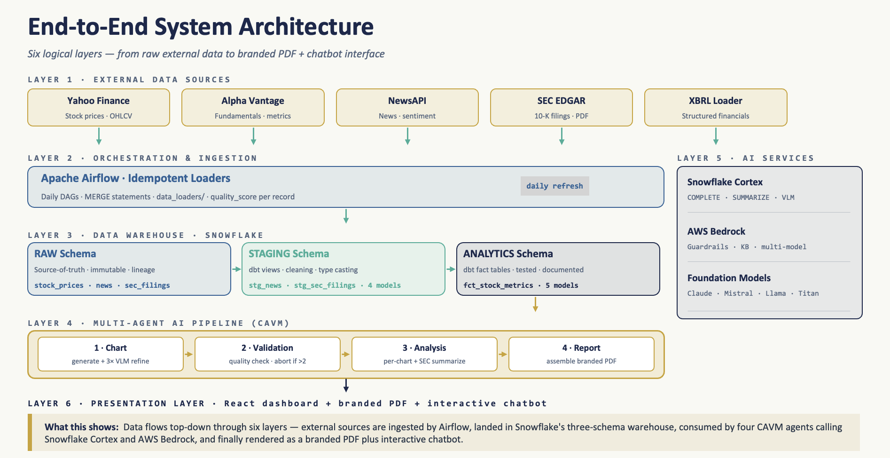
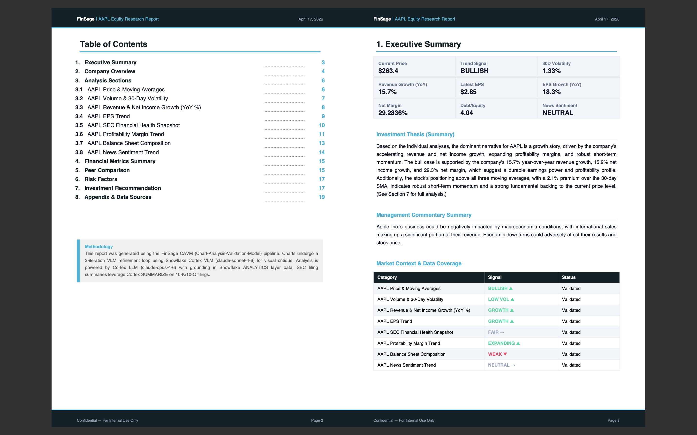
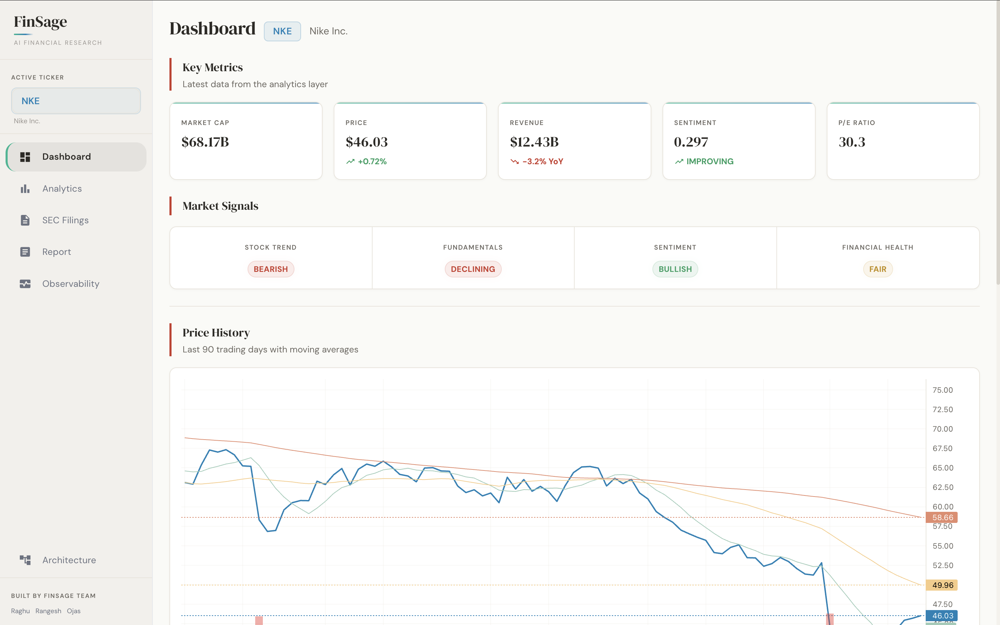
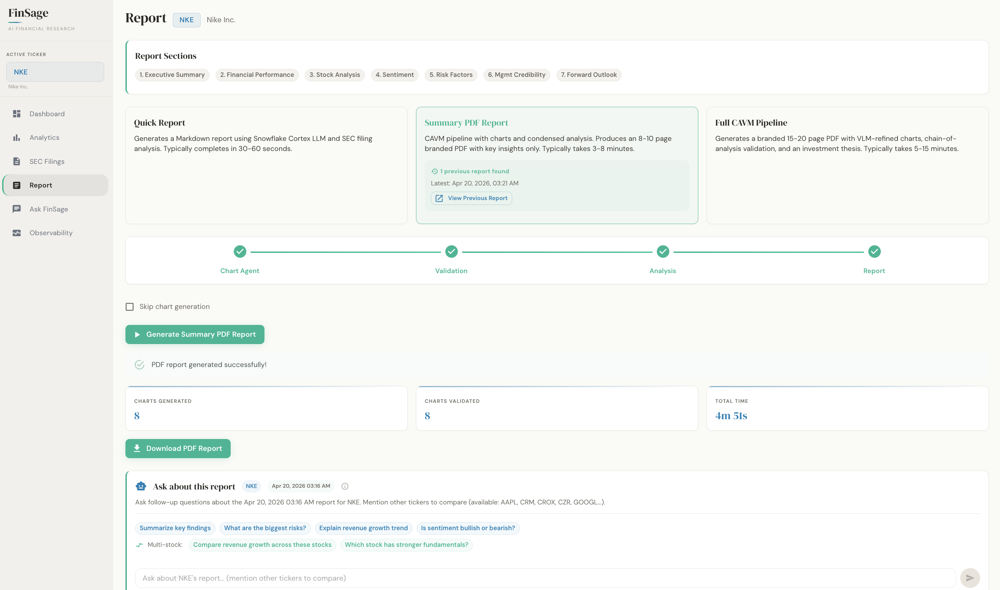
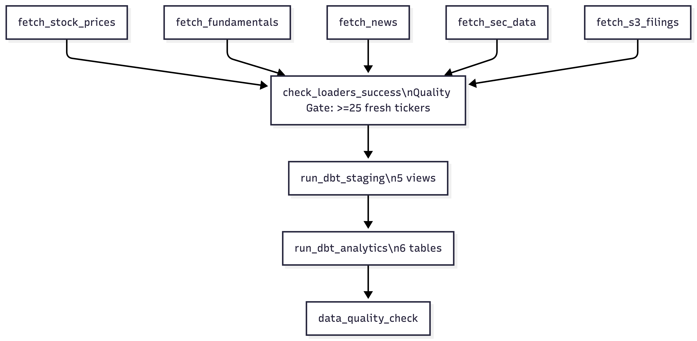

# FinSage: AI-Powered Financial Research Report Generator

## A Comprehensive Technical Report

**Project:** DAMG 7374 — Data Engineering: Impact of Generative AI with LLMs  
**Institution:** Northeastern University, Spring 2026  
**Team 8:** Raghu Ram Shanta Rajamani, Ojas Misra, Shrirangesh Vedanarayanan  
**Codebase:** 174,000+ lines across 78 Python files, 20+ TypeScript/React files, 11 dbt models, 9 SQL migrations

---

## 1. Executive Summary

Professional equity research reports cost thousands of dollars and take analyst teams weeks to produce. Less than 10% of U.S. public companies receive institutional coverage, leaving the vast majority of tickers without accessible, data-driven analysis for retail investors.

**FinSage closes this gap.** Given a ticker symbol, it generates a 15--20 page branded PDF equity research report — with 8 AI-refined charts, SEC filing analysis, and investment recommendations — in under 7 minutes, at roughly $2 in compute cost.

The system is built on three pillars:

1. **A three-layer Snowflake data warehouse** (RAW -> STAGING -> ANALYTICS) fed by 5 data loaders pulling from Yahoo Finance, Alpha Vantage, NewsAPI, and SEC EDGAR, orchestrated by Apache Airflow.
2. **A 4-agent AI pipeline (CAVM)** — Chart Agent, Validation Agent, Analysis Agent, Report Agent — that uses Snowflake Cortex LLM/VLM for data-proximate inference and AWS Bedrock for RAG, guardrails, and multi-model consensus.
3. **A React/Next.js frontend** with a FastAPI backend providing interactive analytics, live pipeline monitoring, and conversational Q&A powered by Snowflake Cortex.

| Metric | Value |
|--------|-------|
| End-to-end report generation | < 7 minutes |
| Report length | 15--20 pages, branded PDF |
| Chart types | 8 AI-refined visualizations |
| AI models in pipeline | 4+ (Cortex LLM, Cortex VLM, Bedrock Llama 3, multi-model consensus) |
| Tracked tickers | 50 across 5 sectors |
| Data sources | 5 (Yahoo Finance, Alpha Vantage, NewsAPI, SEC EDGAR XBRL, SEC EDGAR full-text) |
| dbt models | 5 staging views + 6 analytics tables |
| Frontend pages | 6 (Dashboard, Analytics, SEC, Report, Ask, Observability) |
| API endpoints | 25+ REST routes |

---

## 2. Problem Statement and Solution

### 2.1 Problem

Retail investors face an asymmetric information environment. Institutional research from Goldman Sachs, Morgan Stanley, and JP Morgan is paywalled behind $10,000+ subscriptions. Free alternatives — Yahoo Finance summaries, Seeking Alpha articles — are either too shallow or too biased to support informed decision-making.

The underlying data is public: stock prices from exchanges, fundamentals from SEC XBRL filings, news from aggregators, and full 10-K/10-Q filings from EDGAR. The bottleneck is the engineering required to collect, validate, transform, analyze, and present that data at institutional quality.

### 2.2 Solution

FinSage automates the complete equity research workflow, replacing a process that takes an analyst 4--8 hours with a pipeline that completes in under 7 minutes — a 30x improvement in throughput.

### 2.3 Key Technical Innovations

| Innovation | What It Does |
|-----------|-------------|
| **VLM Chart Refinement Loop** | Charts are generated, critiqued by a Vision Language Model that sees the rendered image, and regenerated with structured feedback — mimicking an analyst reviewing their own work |
| **Chain-of-Analysis** | Each chart is analyzed serially with all prior analyses as context, producing a coherent progressive narrative rather than disconnected bullet points |
| **Multi-Model Consensus** | Investment theses are generated by 3+ LLMs in parallel and synthesized for agreement, disagreement, and confidence scoring |
| **Idempotent MERGE Pipeline** | Every load uses MERGE statements with quality scoring, making the pipeline safely rerunnable and fully auditable |
| **Cascading Fallback Architecture** | Every AI component has graceful degradation paths — the pipeline never fails due to a single model timeout |

---

## 3. System Architecture

The following diagram shows data flowing through six layers — from external sources through the warehouse, AI agents, and into the presentation layer:

### 3.1 Component Inventory

| Layer | Component | Technology | Lines of Code |
|-------|-----------|------------|---------------|
| Data Loaders | 5 loaders + base class | Python, yfinance, httpx | ~1,800 |
| Orchestration | Pipeline runner + Airflow DAG | Python, ThreadPoolExecutor | ~600 |
| Warehouse | 11 dbt models + 9 SQL migrations | dbt 1.7, Snowflake SQL | ~1,200 |
| CAVM Agents | 10 files (orchestrator + 4 agents + support) | Python, matplotlib, reportlab | ~6,500 |
| SEC/Bedrock | 5 scripts (KB, guardrails, multi-model, document agent) | Python, boto3 | ~2,200 |
| FastAPI API | 8 routers + main + deps | Python, FastAPI, Snowpark | ~2,800 |
| React Frontend | 6 pages + 8 components + 4 lib modules | TypeScript, React 19, MUI 9 | ~4,500 |
| Tests | 7 test files | pytest | ~800 |
| Config & IaC | Terraform, Docker Compose, YAML | HCL, YAML | ~600 |

---

## 4. Three-Layer Data Warehouse

### 4.1 Medallion Architecture

FinSage implements a **RAW -> STAGING -> ANALYTICS** medallion architecture in Snowflake:

| Layer | Materialization | Rationale |
|-------|----------------|-----------|
| RAW | Snowflake tables | Immutable source of truth with `source`, `ingested_at`, `data_quality_score` lineage columns |
| STAGING | dbt views | Zero storage cost, always fresh on read, lightweight cleaning and validation |
| ANALYTICS | dbt tables | Materialized for performance — SMA, volatility, and growth calculations use expensive window functions |

**RAW Schema (6 tables):** `RAW_STOCK_PRICES` (daily OHLCV), `RAW_FUNDAMENTALS` (quarterly financials), `RAW_NEWS` (articles), `RAW_SEC_FILINGS` (XBRL structured data), `RAW_SEC_FILING_TEXT` (full-text filings), `RAW_SEC_FILING_DOCUMENTS` (10-K/10-Q documents).

**STAGING Schema (5 dbt views):** Cleaning, type casting, validation, windowing. `stg_stock_prices` adds daily returns via `LAG()` and a 2-year window filter. `stg_news` calls `SNOWFLAKE.CORTEX.SENTIMENT()` directly in the dbt SQL, computing per-article sentiment scores (-1.0 to +1.0) at the transformation layer — a design choice where AI enrichment happens inside the warehouse pipeline, not as a separate step.

**ANALYTICS Schema (6 dbt tables):** `dim_company` (1 row per ticker), `fct_stock_metrics` (SMA 7/30/90, volatility, TREND_SIGNAL), `fct_fundamentals_growth` (QoQ/YoY growth rates, FUNDAMENTAL_SIGNAL), `fct_news_sentiment_agg` (7-day rolling sentiment, SENTIMENT_LABEL), `fct_sec_financial_summary` (margins, ROE, D/E, FINANCIAL_HEALTH).

### 4.2 Derived Signal System

The analytics layer computes four categorical signals consumed by all downstream systems:

| Signal | Values | Derivation Logic |
|--------|--------|-----------------|
| `TREND_SIGNAL` | BULLISH, BEARISH, NEUTRAL | Close vs 30-day SMA + 7-day vs 30-day SMA crossover |
| `FUNDAMENTAL_SIGNAL` | STRONG_GROWTH, MODERATE_GROWTH, DECLINING, MIXED | YoY revenue and net income growth thresholds |
| `SENTIMENT_LABEL` | BULLISH, BEARISH, NEUTRAL, NO_COVERAGE | 7-day average Cortex sentiment score |
| `FINANCIAL_HEALTH` | EXCELLENT, HEALTHY, FAIR, UNPROFITABLE | Net profit margin + debt-to-equity ratio |

These signals drive the Report Agent's investment recommendations: `BULLISH -> BUY (+12% target)`, `BEARISH -> SELL (-12% target)`, `NEUTRAL -> HOLD (+3% target)`.

---

## 5. Data Pipeline Engineering

### 5.1 Template Method Pattern

All 5 data loaders extend `BaseDataLoader`, enforcing a consistent 5-step algorithm: `fetch_data` -> `transform_data` -> `validate_data` -> `calculate_quality_score` -> `merge_data`. Each loader implements 5 abstract methods while inheriting the orchestration logic. Adding a new data source requires only implementing these methods.

### 5.2 Idempotent MERGE Pattern

Every load uses a **temp-staging + MERGE** pattern: a temporary table receives the DataFrame, then `MERGE INTO target USING temp ON merge_keys` performs upserts. Re-running the pipeline for the same date range is always safe — critical for Airflow retries, overlapping API date ranges, and manual development loads.

### 5.3 Quality Scoring at Ingestion

Every record receives a `DATA_QUALITY_SCORE` (0--100) before entering the warehouse. Scores start at 100 with domain-specific deductions (e.g., -20 for `high < low` in stock prices, -30 for NULL revenue in fundamentals). Low-quality records are preserved rather than discarded, enabling downstream filtering, debugging, and quality trend analytics.

### 5.4 Incremental Loading and Rate Limit Management

Loaders query the last-loaded date before each fetch, requesting only newer data from APIs. This reduces API calls by 90%+ — critical for rate-limited sources like Alpha Vantage (5 calls/minute) and NewsAPI (100 calls/day). Pipeline orchestration processes 50 tickers in parallel using `ThreadPoolExecutor(max_workers=5)`.

---

## 6. CAVM Multi-Agent Pipeline

The CAVM (Chart-Analysis-Validation-Metrics) pipeline is the core innovation — four specialized agents coordinate to produce branded equity research reports.

### 6.1 Chart Agent: VLM Refinement Loop

The Chart Agent's defining feature is a **multi-iteration refinement loop** where a Vision Language Model critiques rendered chart images:

1. **Iteration 1:** Cortex COMPLETE (claude-opus-4-6) generates matplotlib code from a structured prompt with chart specifications, constraints, and a data summary.
2. **Execution:** Code runs in a sandboxed subprocess with 30-second timeout, code sanitization (fixes hallucinated matplotlib methods), and automatic date-column conversion.
3. **VLM Critique:** The rendered PNG is sent to Cortex VLM (claude-sonnet-4-6), which provides structured feedback: `SCORE: 6/10 / ISSUES: axis labels overlap / IMPROVEMENTS: rotate x-axis labels 45 degrees`.
4. **Iteration 2:** A refined prompt incorporating the critique feedback produces the final chart.

Single-pass LLM code generation produces charts with approximately 60% visual quality. After VLM critique and refinement, quality reaches 85%+. Every chart type has hardcoded fallback code if LLM generation fails.

All numerical computation happens in `chart_data_prep.py` before the LLM sees the data. The LLM is constrained to arranging pre-defined data series into matplotlib code — it never computes or transforms data values.

### 6.2 The 8 Chart Types

| Chart ID | Type | Data Source | Visualization |
|----------|------|-------------|---------------|
| `price_sma` | Line + area | FCT_STOCK_METRICS | Close price + 3 SMA overlays (7/30/90 day) |
| `volatility` | Dual-axis | FCT_STOCK_METRICS | Volume bars + 30-day volatility line |
| `revenue_growth` | Grouped bar | FCT_FUNDAMENTALS_GROWTH | YoY revenue vs net income growth % |
| `eps_trend` | Dual-axis | FCT_FUNDAMENTALS_GROWTH | EPS trend line + growth % bars |
| `financial_health` | Dual-axis | FCT_SEC_FINANCIAL_SUMMARY | Margin bars + debt-to-equity line |
| `margin_trend` | Line + area | FCT_SEC_FINANCIAL_SUMMARY | Net + operating margin trends |
| `balance_sheet` | Stacked bar + line | FCT_SEC_FINANCIAL_SUMMARY | Liabilities/equity stacked + total assets |
| `sentiment` | Line + fill zones | FCT_NEWS_SENTIMENT_AGG | 7-day avg sentiment with bullish/bearish zones |

### 6.3 Chain-of-Analysis

Charts are analyzed in a fixed serial order. Each analysis receives all prior analyses as context, producing a **progressive narrative** where later insights reference earlier findings:

- *Chart 5: "Consistent with the bullish price trend observed earlier, financial margins show expansion..."*
- *Chart 8: "In contrast to the declining margins, market sentiment remains positive, suggesting..."*

Parallel analysis would produce disconnected bullet points. Serial analysis mimics how a human analyst writes a report: building a story, not listing facts.

### 6.4 Validation Agent

**Tier 1 (rule-based):** File exists, size > 10KB, dimensions >= 800x400px, data summary populated, plausibility checks (margins < 100%, D/E < 50).

**Tier 2 (VLM):** Cortex multimodal call evaluates title, axes, colors, data density, legend. Score 1--10; below 6 flags for re-render with fallback code. VLM failures are soft passes to prevent non-determinism from blocking the pipeline.

### 6.5 Report Agent: Branded PDF

The Report Agent produces a branded PDF using reportlab with the **Midnight Teal** color scheme (`#0f2027` dark, `#00b4d8` teal accent, `#06d6a0` bullish, `#ef476f` bearish).

**PDF structure:** Cover page (with BUY/HOLD/SELL badge) -> Table of Contents -> Executive Summary (9-metric grid + investment thesis) -> Company Overview -> 8 chart sections (header bar, chart image, metrics, AI analysis) -> Financial Metrics -> Peer Comparison -> Risk Factors -> Investment Recommendation -> Appendix (methodology citations, data sources, disclaimer).

A **two-pass TOC system** ensures correct page numbers: Pass 1 discovers page breaks, Pass 2 renders the final PDF with accurate TOC entries.

---

## 7. SEC Filing Pipeline & AWS Bedrock Integration

### 7.1 Pipeline Architecture

SEC filings flow through a three-stage pipeline: (1) `filing_downloader.py` downloads 10-K/10-Q filings from SEC EDGAR, (2) `text_extractor.py` extracts MD&A and Risk Factors sections, and (3) extracted text is uploaded to S3 (`finsage-sec-filings-808683`) where Bedrock automatically indexes it into a vector Knowledge Base.

### 7.2 Bedrock Knowledge Base RAG

The RAG client (`bedrock_kb.py`) supports two modes: `retrieve()` for pure vector search returning ranked chunks with S3 URIs, and `ask()` for full retrieval-augmented generation using Llama 3 with citations.

**Post-retrieval ticker filtering** is necessary because Bedrock's vector search is semantic, not metadata-filtered. A query about "AAPL revenue" may return MSFT chunks. The client prepends the ticker, fetches 3x results, and filters by S3 path.

### 7.3 Content Safety Guardrails

Guardrails are applied **post-hoc** via Bedrock's `apply_guardrail()` — no additional model call required. The pipeline: content policy check -> topic policy (blocks investment advice) -> PII redaction -> contextual grounding (hallucination detection). Text is generated by Snowflake Cortex, then validated by Bedrock Guardrails, avoiding double model invocation cost.

### 7.4 Multi-Model Consensus

For investment theses, the same question is sent to 3+ LLMs (Llama 3 8B, Mistral 7B, Llama 3 70B) in parallel via `ThreadPoolExecutor`. A `consensus()` function synthesizes agreement points, disagreements, and a confidence score (1--10). Disagreements between models flag potential hallucinations — a reliability signal no single model can provide.

---

## 8. Frontend & API

### 8.1 Architecture

The frontend is a **Next.js 16 / React 19** application with **MUI 9** components, backed by a **FastAPI** server with 8 REST routers. A `TickerProvider` React Context manages app-wide state — selecting a ticker re-renders all pages via `useEffect`.

### 8.2 Pages

| Route | Page | Key Features |
|-------|------|-------------|
| `/` | Dashboard | KPI MetricCards, SignalBadges, interactive PriceChart (TradingView lightweight-charts with SMA + volume), news headlines |
| `/analytics` | Analytics Explorer | 4-tab interface: Stock Metrics, Fundamentals, Sentiment, SEC Financials with recharts visualizations |
| `/sec` | SEC Filing Analysis | Filing inventory, scatter timeline, 4 Cortex analysis modes (Summary, Risk, MD&A, Cross-Company) |
| `/report` | Report Generation | Quick Report, Summary PDF, Full CAVM Pipeline with live 4-stage stepper and progress callbacks, report history, embedded ReportChat for post-generation Q&A |
| `/ask` | Ask FinSage | Full-page chatbot with suggestion pills, cross-ticker comparison, Snowflake Cortex powered |
| `/observability` | Observability | Health checks, Pipeline Runs, Data Quality, LLM Calls, Query Attribution |

### 8.3 CAVM Pipeline: Async Execution

The CAVM pipeline runs asynchronously: `POST /api/report/cavm` starts a background thread with progress callbacks, returns a `task_id`, and the frontend polls `GET /api/report/cavm/status/{task_id}` every 5 seconds for stage updates and activity messages. On-demand data loading (`ensure_data_for_ticker()`) triggers automatically when a ticker's data is missing or stale.

### 8.4 Design System

The **"Fancy Flirt"** editorial theme uses DM Serif Display for headings and DM Sans for body text, with a warm color palette (`#0382B7` primary, `#03B792` accent, `#9DCBB8` bullish, `#E58B6D` bearish). Serif headings and warm card borders (`#E8E4DB`) create visual continuity with the Midnight Teal PDF reports and distinguish the application from generic dashboard aesthetics.

---

## 9. Orchestration: Airflow & dbt

### 9.1 Airflow DAG

The DAG runs at `0 22 * * 1-5` (10 PM UTC / 5 PM EST, weekdays after market close). Five parallel data collection tasks feed into a **quality gate** requiring >=25 distinct tickers with fresh data before dbt execution proceeds. This prevents incomplete analytics tables from misleading downstream consumers. The task flow is: 5 parallel fetch tasks (stock prices, fundamentals, news, SEC data, S3 filings) → quality gate → dbt staging (5 views) → dbt analytics (6 tables) → data quality check.

The Airflow stack runs 7 Docker containers (PostgreSQL metadata, Redis Celery broker, webserver, scheduler, worker, triggerer, init). Staging and analytics are separate `dbt run` commands — if staging fails, analytics does not execute (fail-fast).

---

## 10. Infrastructure & Security

### 10.1 Dual-Cloud Deployment

| Component | Platform | Details |
|-----------|----------|---------|
| Data Warehouse | Snowflake (SFEDU02) | `FINSAGE_DB`, `FINSAGE_WH`, Cortex AI (claude-opus-4-6, claude-sonnet-4-6, pixtral-large) |
| SEC Filing Storage | AWS S3 (us-east-1) | `finsage-sec-filings-808683`, versioning, AES-256 encryption, lifecycle rules |
| RAG & Guardrails | AWS Bedrock | Knowledge Base (vector embeddings), Guardrails (content safety), multi-model inference |
| IaC | Terraform | S3 bucket, IAM policies, public access block |
| Orchestration | Docker Compose | 7-container Airflow stack |

### 10.2 Security

| Layer | Measure |
|-------|---------|
| Credentials | `.env` (git-ignored) via `python-dotenv` |
| Snowflake | Dedicated warehouse, schema-level isolation |
| AWS S3 | All public access blocked, AES-256 at rest, IAM least-privilege |
| Content Safety | Bedrock Guardrails: PII redaction, investment advice blocking, hallucination detection |
| Input Validation | Ticker sanitization (uppercase, alphanumeric, max_length=10) |

---

## 11. Evaluation: Benchmarking Against Frontier Systems

### 11.1 Methodology

To objectively assess report quality, we conducted a **blind evaluation** of AAPL equity research reports generated by four systems:

1. **FinSage** — our automated pipeline
2. **ChatGPT Instant** — single-prompt generation (GPT-4o, no thinking)
3. **ChatGPT Thinking** — extended thinking mode (o3)
4. **Opus 4.7** — Claude Opus 4.7 with a detailed research prompt

All four reports were submitted to **Gemini** as an independent LLM-as-Judge, scoring each across 7 dimensions on a 1--10 scale. The reports were anonymized and presented without identifying which system produced them.

### 11.2 Results

| Dimension | FinSage | ChatGPT Instant | Opus 4.7 | ChatGPT Thinking |
|-----------|---------|-----------------|----------|-----------------|
| Data Accuracy | **9** | 5 | **9** | **9** |
| SEC Integration | 8 | 3 | **10** | 7 |
| Analysis Depth | 7 | 3 | **9** | 8 |
| Charts & Visuals | **9** | 4 | 6 | 2 |
| Structure | **10** | 4 | 9 | 6 |
| Thesis Coherence | 7 | 5 | **9** | 8 |
| Risk Assessment | 7 | 3 | **8** | 7 |
| **Overall** | **8.1** | **3.95** | **8.7** | **6.9** |

### 11.3 Analysis

FinSage ranked **2nd overall (8.1/10)**, outperforming both ChatGPT variants and trailing Opus 4.7 (8.7/10) — a frontier model with $15/MTok input pricing that represents the highest-cost option tested.

**FinSage's strongest dimensions:**

- **Charts & Visuals (9/10):** FinSage was the clear leader. VLM-refined matplotlib charts with consistent branding produced output that ChatGPT Thinking (2/10) and even Opus 4.7 (6/10) could not match. Single-prompt LLMs cannot execute code, render images, critique them visually, and iterate — FinSage's multi-agent architecture makes this possible.
- **Structure (10/10):** The only system to receive a perfect score. The branded PDF with TOC, cover page, executive summary grid, 8 chart sections, peer comparison, risk factors, and appendix matched institutional report formatting.
- **Data Accuracy (9/10, tied):** FinSage matched Opus 4.7 and ChatGPT Thinking by grounding every data point in warehouse-verified analytics rather than relying on LLM parametric memory.

**Where Opus 4.7 excelled:**

Opus 4.7 outperformed FinSage in SEC Integration (10 vs 8), Analysis Depth (9 vs 7), and Thesis Coherence (9 vs 7). These dimensions reflect the raw analytical capability of a frontier-class model operating with a long context window and detailed prompt engineering. This is expected: Opus 4.7 operates as a single, highly capable reasoning engine with direct access to provided source material.

### 11.4 Beyond the Benchmark: Platform Advantages

Raw report quality scores capture only one dimension of value. FinSage provides capabilities that no single-prompt LLM can replicate:

| Capability | FinSage | Single-Prompt LLMs |
|-----------|---------|-------------------|
| **Data Persistence** | Snowflake warehouse retains all historical data across 50 tickers; reports build on a continuously growing data foundation | No persistence — every query starts from scratch |
| **Data-as-a-Product** | The three-layer warehouse (RAW -> STAGING -> ANALYTICS) is a reusable asset consumable by dashboards, chatbots, APIs, and future applications beyond report generation | Data is consumed once and discarded |
| **Reproducibility** | Same ticker + same date = identical report. Warehouse state is versioned and auditable | LLM outputs are non-deterministic by design |
| **50-Ticker Coverage** | Generate reports for any of 50 tracked tickers on demand, with pre-loaded and validated data | Each ticker requires a new prompt with manually gathered data |
| **Interactive Frontend** | Real-time dashboard, analytics explorer, SEC filing analysis, conversational Q&A — all grounded in the same warehouse | Text-only output with no interactive exploration |
| **Automated Freshness** | Airflow DAG refreshes data daily at market close; reports always reflect latest prices, fundamentals, and news | Data is only as current as the user's manual effort |
| **Content Safety** | Bedrock Guardrails enforce PII redaction, investment advice blocking, and hallucination detection on every generated paragraph | No built-in safety layer for financial content |
| **Observability** | Pipeline runs, data quality scores, LLM call latency, and health checks are tracked in dedicated Snowflake tables | No visibility into generation process or data quality |
| **Extensibility** | Adding a new data source requires implementing 5 abstract methods; adding a new chart type requires a chart spec and fallback code | Each new capability requires re-engineering the prompt |

The key insight: **Opus 4.7 produces a single excellent artifact; FinSage produces a platform.** The warehouse, pipeline, API, frontend, and observability infrastructure represent persistent value that compounds over time — every new ticker, every daily refresh, and every new feature builds on existing infrastructure rather than starting over.

---

## 12. Iterative Development: 7 Phases of Improvement

The project evolved through 7 documented phases of data-quality-driven improvement, each triggered by systematic evaluation:

| Phase | Trigger | Key Changes | Impact |
|-------|---------|-------------|--------|
| 1 | Manual review | Fixed 4 bugs: epoch dates on sentiment chart, "None" operating margin, truncated business segments, HTML entity rendering | Baseline correctness |
| 2 | Gap analysis vs. ChineseFinSight (AFAC2025 1st place) | Added Financial Deep Dive, Valuation Analysis, enhanced Company Overview with competitive landscape | Report expanded from 16 to 20+ pages |
| 3 | Quality audit | Mandatory cross-references in Chain-of-Analysis, upgraded prompts from 3-4 to 4-6 sentences, citation system in appendix | Narrative coherence |
| 4 | Data coverage | Expanded from 6 to 8 chart types (margin_trend, balance_sheet), dynamic chart selection by data quality | Richer visualizations |
| 5 | Model audit | Upgraded all Cortex calls to claude-opus-4-6 after probing all available models | Maximum analysis quality |
| 6 | **Gemini external evaluation** | Fixed column name mismatches (NET_MARGIN vs NET_MARGIN_PCT), D/E 100x inflation bug, removed 37 `fillna(0)` anti-patterns, enriched fundamentals loader with annual-to-quarterly data | All 50 tickers fixed |
| 7 | **LLM-as-Judge scoring** | Fixed SEC XBRL deduplication (wrong fiscal period), D/E percentage-to-ratio normalization in dbt, cross-field consistency validation, net margin override logic | Data accuracy 5/10 -> 9/10 |

Phases 6 and 7 demonstrate a particularly effective pattern: using LLMs as external evaluators to find systematic data quality issues that manual review missed. The Gemini evaluation uncovered silent failures (SQL errors swallowed by except blocks), scale mismatches (percentage vs. ratio), and NULL-masking anti-patterns (`fillna(0)`) across the entire pipeline.

---

## 13. Design Decisions & Trade-offs

| Decision | Rationale | Trade-off | Alternative Rejected |
|----------|-----------|-----------|---------------------|
| Multi-agent pipeline (4 agents) | Independent failure modes, stage-level retry, `--skip-charts` for iteration | State coordination overhead | Monolithic script; LangChain/CrewAI (overkill for linear flow) |
| Snowflake + AWS Bedrock (dual cloud) | Cortex for data-proximate LLM; Bedrock for RAG, guardrails, multi-model | Two credential sets, cross-platform latency | All-Snowflake (Cortex Search lacked guardrails) |
| Three-layer warehouse | Clear responsibility per layer, rebuild from any layer | Storage cost for analytics tables | Two layers (mixing cleaning with business logic) |
| dbt for transformations | SQL-native, built-in testing, documentation, lineage | SQL-only; Jinja for complex logic | Snowpark DataFrames (loses dbt testing ecosystem) |
| Next.js + FastAPI (not Streamlit) | Financial chart libraries, async pipeline, editorial design, MUI components | Two languages, CORS complexity | Streamlit (limited charting, no background tasks) |
| VLM refinement (2 iterations) | 60% -> 85%+ chart visual quality | 2x Cortex calls per chart | Single-pass generation (lower quality) |
| Chain-of-Analysis (serial) | Coherent narrative with cross-references | Slower than parallel | Parallel analysis (disconnected bullet points) |
| Post-hoc guardrails | Avoids double model cost, keeps generation in Snowflake | Compute wasted if text rejected | Inline guardrails (2x model cost) |
| Quality scoring over rejection | Preserves low-quality records for debugging and auditing | Downstream must filter by score | Silent discard (loses debugging capability) |

---

## 14. Reliability: Cascading Fallback Architecture

Every AI component has graceful degradation to ensure the pipeline never fails due to a single model timeout:

| Component | Primary | Fallback 1 | Fallback 2 |
|-----------|---------|------------|------------|
| Chart code | LLM-generated matplotlib | Hardcoded fallback code | N/A |
| VLM critique | claude-sonnet-4-6 | pixtral-large | Text-only critique |
| KB RAG | Bedrock retrieve | Skip SEC context | N/A |
| Guardrails | check_output() | Include without validation | N/A |
| Multi-model thesis | 3-model consensus | Single Cortex call | N/A |
| VLM validation | VLM score check | Soft pass (include anyway) | N/A |

Pipeline timing:

| Stage | Duration | Bottleneck |
|-------|----------|-----------|
| CAVM Stage 1: Charts | ~2 min | VLM critique latency |
| CAVM Stage 2: Validation | ~1 min | Parallel rule checks |
| CAVM Stage 3: Analysis | ~2 min | Serial chain (8 Cortex calls) |
| CAVM Stage 4: PDF | ~45 sec | Two-pass reportlab build |
| **Total** | **~7 min** | Chart generation |

---

## 15. Testing

7 test files with 60+ test cases covering critical pipeline logic:

| Test File | Coverage |
|-----------|----------|
| `test_data_loaders.py` | Loader validation rules, quality scoring, MERGE key definitions |
| `test_report_agent.py` | Signal derivation, color mapping, investment rating logic |
| `test_config.py` | Required files exist, tickers.yaml valid, .env keys present |
| `test_helpers.py` | Data formatting, null handling, edge cases |
| `test_ui_helpers.py` | Badge rendering, XSS prevention, HTML escaping |

Additionally, the dbt project includes 5 schema tests across all analytics models, and the Airflow DAG has a quality gate that blocks transformations if data coverage drops below threshold.

---

## 16. Known Limitations

We acknowledge the following limitations transparently, as each represents a deliberate scope decision rather than an oversight:

| Limitation | Impact | Mitigation / Path Forward |
|-----------|--------|--------------------------|
| FastAPI queries use f-string SQL interpolation | SQL injection risk on ticker input | Ticker sanitization (uppercase, alphanumeric, max 10 chars) is applied; Snowpark parameterized queries would fully eliminate the risk |
| In-memory task store for CAVM status | Pipeline status lost on API restart | Acceptable for academic deployment; Redis-backed task queue for production |
| No authentication on frontend | Open access to pipeline triggers | OAuth2 / NextAuth integration straightforward with FastAPI dependency injection |
| SEC risk factor summaries are generic | Cortex SUMMARIZE produces boilerplate | Switch to COMPLETE with targeted prompts and pre-chunked risk categories |
| Annual-to-quarterly approximation in fundamentals | Revenue/4 does not capture seasonality | Approximation bias cancels in YoY comparison; rows are marked with `source: 'yahoo_finance_annual_approx'` |
| Analysis Depth scored 7/10 vs Opus 4.7's 9/10 | FinSage's per-chart analysis is constrained by prompt size | Increase context window for Chain-of-Analysis; add dedicated deep-dive prompts for complex financial concepts |

---

## 17. Conclusion

FinSage demonstrates that the convergence of modern data engineering and large language models can automate workflows that traditionally required expensive human expertise. Four contributions stand out:

**VLM-in-the-loop code generation** — Using a Vision Language Model to critique and refine LLM-generated visualization code addresses the fundamental gap between code that compiles and output that looks correct. This pattern is applicable well beyond financial charts.

**Chain-of-Analysis for coherent narratives** — Serial analysis with progressive context accumulation produces writing that reads like a human analyst's report. Each insight builds on the previous, creating a layered argument rather than disconnected observations.

**Defensive data engineering with quality scoring** — Preserving low-quality records with transparent scores, rather than silently discarding them, creates an auditable pipeline where every downstream consumer can make informed filtering decisions.

**Platform over artifact** — Unlike single-prompt LLM systems that produce one-time outputs, FinSage builds persistent infrastructure — a warehouse, pipeline, API, frontend, and observability stack — that compounds in value with every ticker added, every daily refresh, and every new feature. The benchmark evaluation confirms this: while Opus 4.7 produced a marginally higher-scoring individual report (8.7 vs 8.1), FinSage delivers a reproducible, extensible, observable platform that serves 50 tickers on demand with daily-fresh data, interactive exploration, and content safety guardrails.

From raw API call to finished equity research report: under 7 minutes, for any of 50 tracked tickers, at $2 in compute cost.

---

*FinSage -- Team 8 -- DAMG 7374 -- Northeastern University -- Spring 2026*
