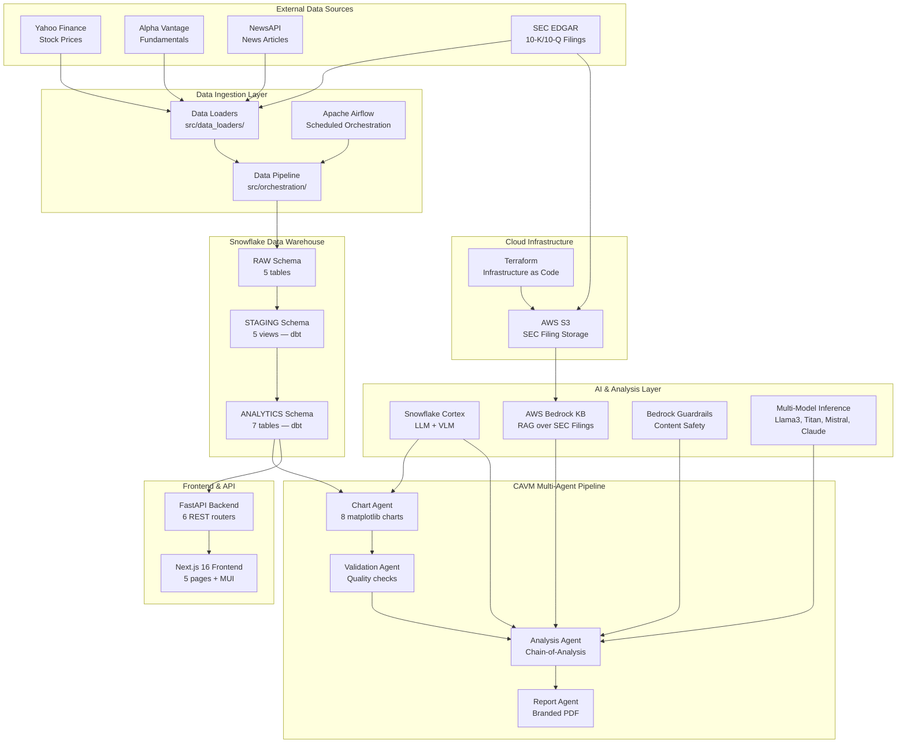

# FinSage System Architecture

## What is FinSage?

FinSage is an AI-powered financial research report generation system for U.S. public companies. It automates the entire workflow from raw data collection through AI-driven analysis to the production of branded 15-20 page PDF equity research reports with visualizations and citations.

**Built for:** DAMG 7374 — Northeastern University  
**Tracked Tickers:** AAPL, GOOGL, JPM, MSFT, TSLA (expandable via `config/tickers.yaml`)

---

## High-Level System Architecture



---

## Component Inventory

| Layer | Component | Technology | Purpose |
|-------|-----------|------------|---------|
| **Data Sources** | Yahoo Finance | yfinance Python lib | Daily OHLCV stock prices |
| | Alpha Vantage | REST API + API key | Quarterly fundamentals (EPS, revenue, P/E) |
| | NewsAPI | REST API + API key | Financial news articles with sentiment |
| | SEC EDGAR | REST API (public) | 10-K/10-Q filings (XBRL structured + full-text) |
| **Ingestion** | Data Loaders | Python, BaseDataLoader ABC | 5 loaders with template method pattern |
| | Pipeline Orchestrator | ThreadPoolExecutor | Parallel ticker processing |
| | Airflow | Docker Compose, CeleryExecutor | Scheduled daily at 5 PM EST |
| **Warehouse** | RAW | Snowflake | 5 raw tables with `source`, `ingested_at`, `data_quality_score` |
| | STAGING | dbt views | 5 cleaned/validated views |
| | ANALYTICS | dbt tables | 2 dimensions + 5 fact tables with derived signals |
| **AI/ML** | Snowflake Cortex | COMPLETE, SUMMARIZE, VLM | LLM analysis + chart critique |
| | Bedrock KB | Llama 3 + embeddings | RAG over SEC filings |
| | Guardrails | Bedrock Guardrails | Block investment advice, redact PII, detect hallucinations |
| | Multi-Model | Llama3, Titan, Mistral, Claude | Consensus-based analysis |
| **Report Gen** | CAVM Pipeline | 4 Python agents | Chart → Validate → Analyze → Report |
| **Frontend** | FastAPI | Python, 6 routers | REST API serving analytics + triggering pipelines |
| | Next.js 16 | React 19, MUI 9, TypeScript | 5-page interactive dashboard |
| **Infrastructure** | S3 | AWS, Terraform | SEC filing document storage |
| | Docker Compose | Airflow stack (7 containers) | Scheduler + worker + broker |

---

## End-to-End Data Flow

```
┌──────────────────────────────────────────────────────────────────────┐
│                        DATA COLLECTION                               │
│                                                                      │
│  Yahoo Finance ──┐                                                   │
│  Alpha Vantage ──┤── Data Loaders ──► merge_data() ──► RAW Tables   │
│  NewsAPI ────────┤   (5 loaders)      (idempotent)                   │
│  SEC EDGAR ──────┘                                                   │
│                                                                      │
│  Airflow DAG runs daily at 5 PM EST (weekdays only)                 │
│  50 tickers processed in batches of 10                              │
└──────────────────────────────┬───────────────────────────────────────┘
                               │
                               ▼
┌──────────────────────────────────────────────────────────────────────┐
│                        DATA TRANSFORMATION                           │
│                                                                      │
│  RAW ──► dbt staging (views) ──► dbt analytics (tables)             │
│                                                                      │
│  Staging: filter invalid, compute daily returns, 2-year window      │
│  Analytics: SMA, volatility, growth rates, sentiment aggregation    │
│  Signals: BULLISH/BEARISH/NEUTRAL, STRONG_GROWTH/DECLINING, etc.    │
└──────────────────────────────┬───────────────────────────────────────┘
                               │
                    ┌──────────┴──────────┐
                    ▼                     ▼
┌────────────────────────┐  ┌──────────────────────────────────────────┐
│   INTERACTIVE FRONTEND  │  │       CAVM REPORT GENERATION             │
│                         │  │                                          │
│  Next.js ◄── FastAPI    │  │  1. Chart Agent ── 8 matplotlib charts   │
│                         │  │     └─ VLM refinement (claude-sonnet-4-6)│
│  5 pages:               │  │  2. Validation Agent ── quality checks   │
│  • Dashboard            │  │  3. Analysis Agent ── Chain-of-Analysis  │
│  • Analytics Explorer   │  │     ├─ Cortex LLM (mistral-large)       │
│  • SEC Filing Analysis  │  │     ├─ Bedrock KB RAG                   │
│  • Report Generation    │  │     ├─ Guardrails validation            │
│  • Ask FinSage (Chat)   │  │     └─ Multi-model consensus            │
│                         │  │  4. Report Agent ── branded PDF          │
└─────────────────────────┘  └──────────────────────────────────────────┘
```

---

## Technology Stack Rationale

| Technology | Why This Choice |
|-----------|-----------------|
| **Snowflake** | Academic account (SFEDU02), native Cortex AI integration, Snowpark for Python-native queries, zero infrastructure management |
| **dbt** | SQL-based transformations with lineage, testing, and documentation built in; staging views for freshness, analytics tables for performance |
| **Apache Airflow** | Industry-standard orchestration, DAG-based dependency management, CeleryExecutor for parallel task execution |
| **Snowflake Cortex** | SQL-callable LLM/VLM — no API keys needed, models run inside the warehouse, low latency for data-proximate inference |
| **AWS Bedrock** | Managed RAG (Knowledge Base) over SEC filings without building vector DB infrastructure; Guardrails for financial compliance; multi-model access |
| **Next.js 16 + MUI** | Server-side rendering, TypeScript safety, Material UI component library for rapid UI development |
| **FastAPI** | Async Python backend matching the data team's language, auto-generated OpenAPI docs, native Pydantic validation |
| **Terraform** | Reproducible S3 infrastructure, IAM policies as code, version-controlled cloud resources |
| **reportlab** | Programmatic PDF generation with precise layout control — needed for branded equity research format |

---

## Key Design Principles

1. **Idempotency everywhere** — MERGE statements prevent duplicates; reruns are safe
2. **Incremental loading** — Only fetch data since `get_last_loaded_date()`; reduces API calls and cost
3. **Quality scoring** — Every record gets a 0-100 quality score before warehouse entry
4. **Defensive data flow** — Staging views filter invalid records before analytics; quality gate in Airflow blocks dbt if data is stale
5. **Graceful degradation** — Every AI component has fallback paths; partial data returns instead of failures
6. **Separation of concerns** — Data loaders know nothing about analytics; agents know nothing about ingestion; frontend only talks to the API

---

*Next: [02-data-pipeline-architecture.md](./02-data-pipeline-architecture.md) — Deep dive into the data ingestion pipeline*
