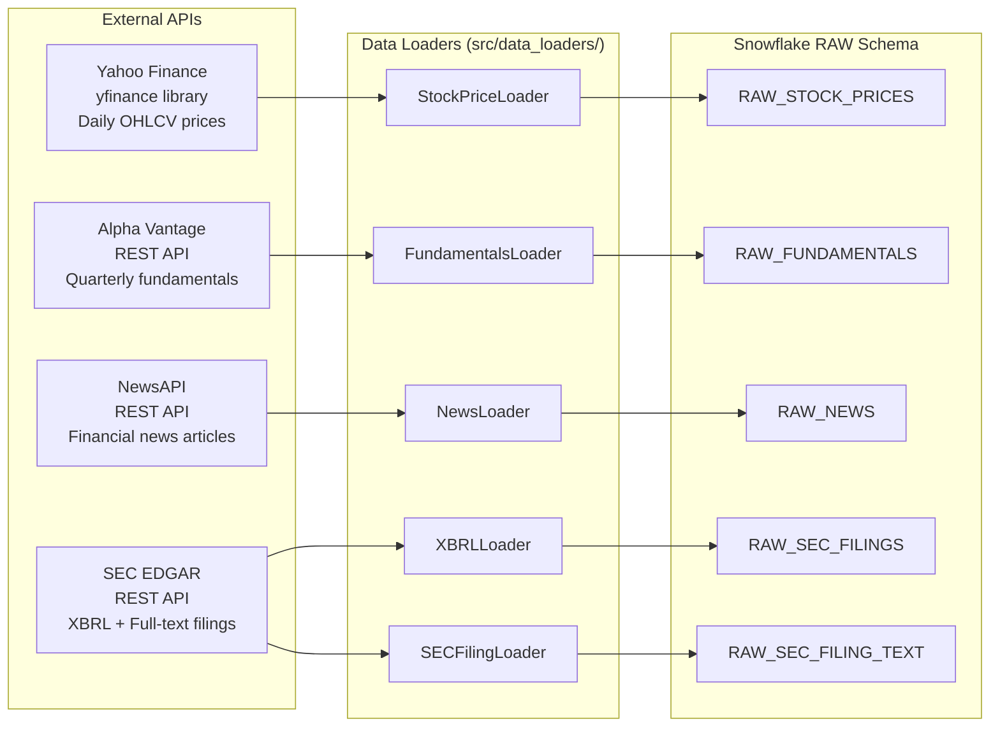
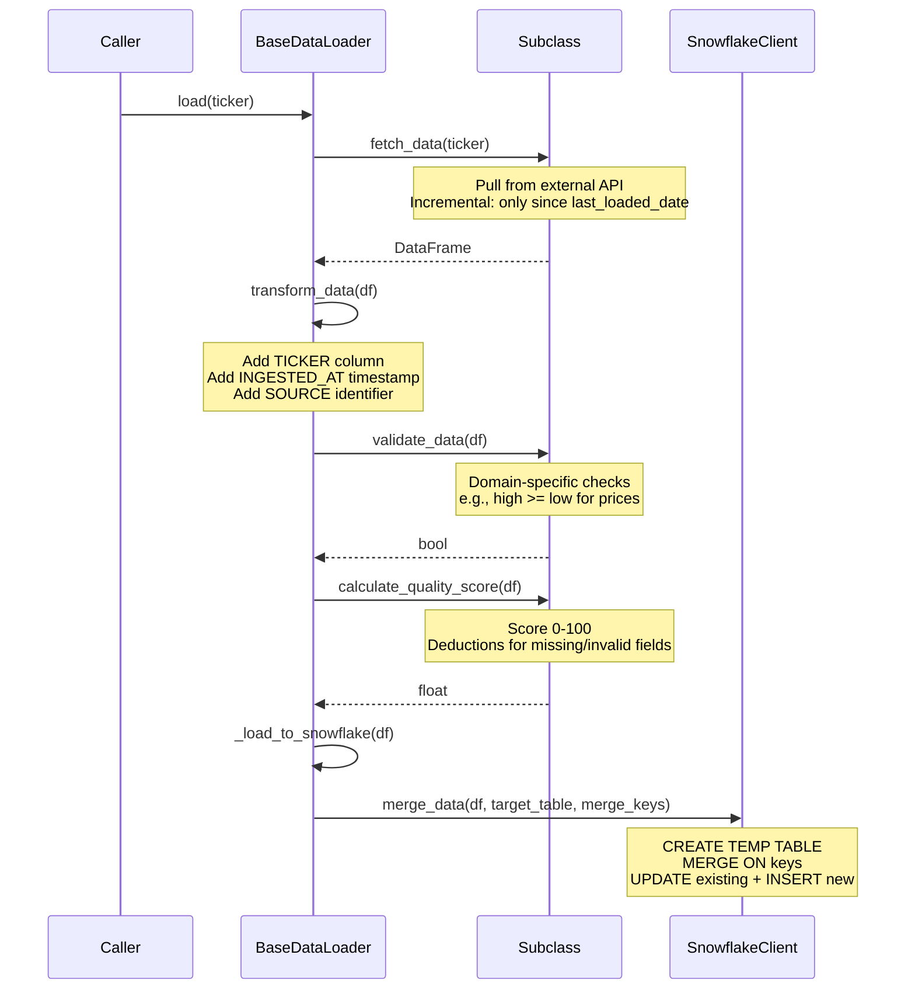
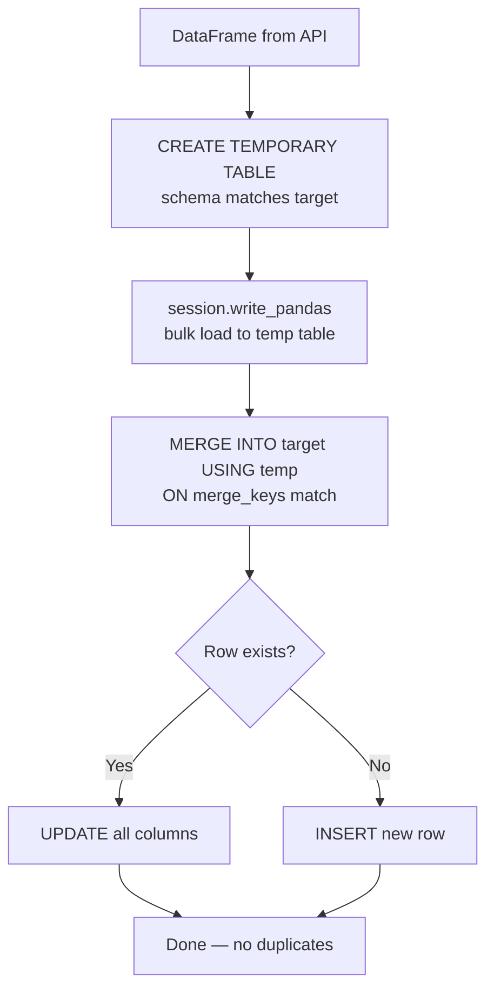
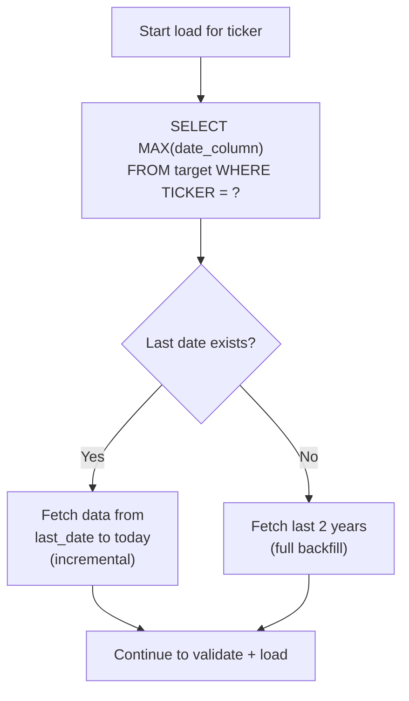
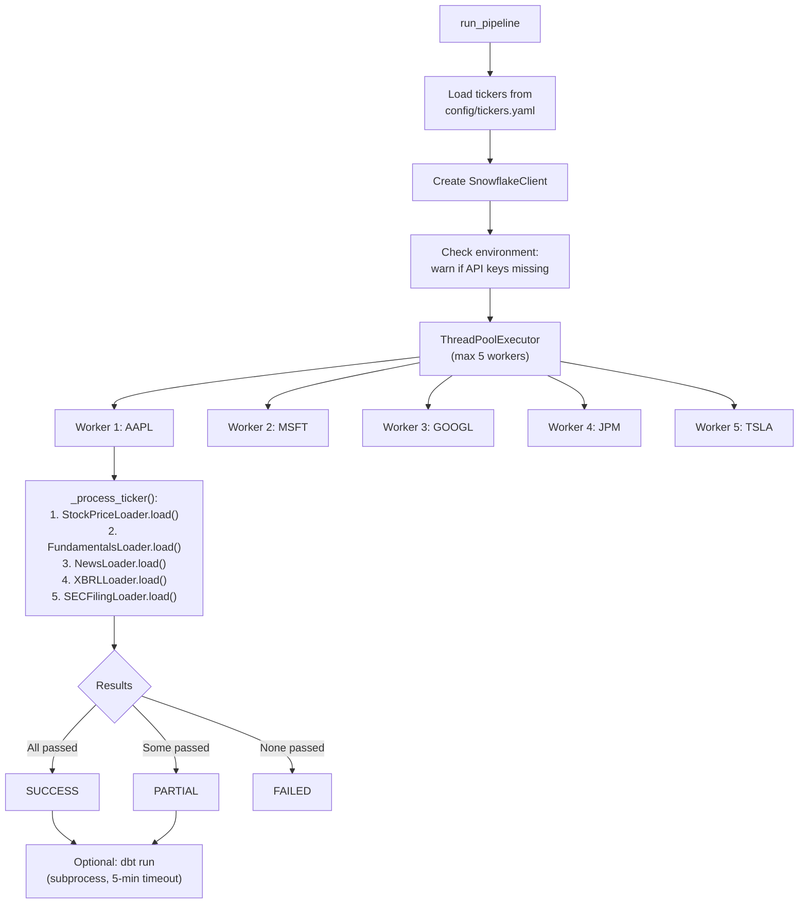
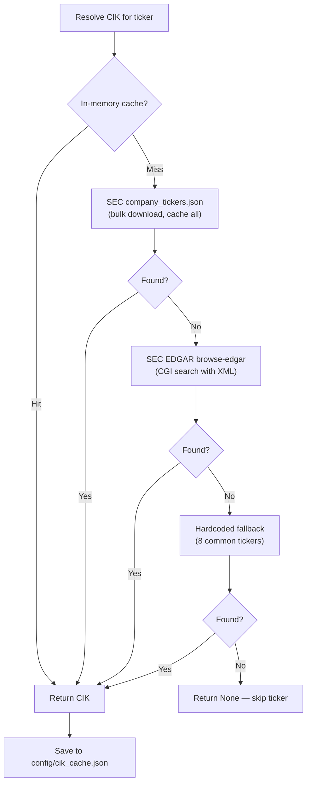

# Data Pipeline Architecture

## What It Does

The data pipeline collects financial data from 4 external sources, validates it, scores its quality, and loads it into Snowflake using idempotent MERGE operations. It supports both manual runs and scheduled Airflow execution.

---

## Data Source Overview



---

## Template Method Pattern (BaseDataLoader)

**What:** All 5 data loaders extend a single abstract base class that enforces a consistent 5-step loading algorithm.

**Why:** This guarantees that every data source follows the same validation, quality scoring, and loading logic. Adding a new data source only requires implementing 5 abstract methods — the workflow is fixed.



### Abstract Methods Each Loader Implements

| Method | Purpose | Example (StockPriceLoader) |
|--------|---------|---------------------------|
| `fetch_data(ticker)` | Pull raw data from API | `yfinance.Ticker(ticker).history()` |
| `validate_data(df)` | Domain-specific validation | `high >= low`, no negative prices |
| `calculate_quality_score(df)` | Quality score (0-100) | -20 for `high < low`, -30 for nulls |
| `get_target_table()` | Snowflake target table | `'RAW.RAW_STOCK_PRICES'` |
| `get_merge_keys()` | MERGE ON columns | `['TICKER', 'DATE']` |

---

## Idempotent MERGE Pattern

**What:** Every load operation uses a Snowflake MERGE statement instead of INSERT. This means re-running the pipeline for the same data never creates duplicates.

**Why:** Financial data pipelines must be rerunnable. API failures, partial loads, and schedule overlaps are common. MERGE handles all these cases safely.



**SQL generated by `merge_data()`:**
```sql
MERGE INTO RAW.RAW_STOCK_PRICES AS target
USING TEMP_RAW_STOCK_PRICES_STAGING AS source
ON target.TICKER = source.TICKER 
   AND target.DATE = source.DATE
WHEN MATCHED THEN UPDATE SET
    target.OPEN = source.OPEN,
    target.HIGH = source.HIGH,
    target.LOW = source.LOW,
    target.CLOSE = source.CLOSE,
    target.VOLUME = source.VOLUME,
    target.DATA_QUALITY_SCORE = source.DATA_QUALITY_SCORE,
    target.INGESTED_AT = source.INGESTED_AT
WHEN NOT MATCHED THEN INSERT (TICKER, DATE, OPEN, HIGH, LOW, CLOSE, VOLUME, ...)
    VALUES (source.TICKER, source.DATE, source.OPEN, ...)
```

---

## Incremental Loading Strategy

**What:** Loaders query Snowflake for the last loaded date and only fetch newer data.

**Why:** Minimizes API calls (critical for rate-limited APIs like Alpha Vantage), reduces data transfer, and speeds up pipeline runs.



---

## Quality Scoring System

**What:** Every record receives a `DATA_QUALITY_SCORE` (0-100) before entering the warehouse.

**Why:** Downstream consumers (analytics, reports) can filter by quality. Low-quality records are preserved (not discarded) but flagged for investigation.

### Scoring Rules by Loader

| Loader | Deduction | Reason |
|--------|-----------|--------|
| **Stock Prices** | -20 | `high < low` |
| | -10 | `open` outside `[low, high]` range |
| | -10 | `close` outside `[low, high]` range |
| | -30 | Any null in OHLC columns |
| **Fundamentals** | -15 | Missing revenue |
| | -15 | Missing EPS |
| | -10 | Missing market cap |
| | -10 | Any null in key metrics |
| **News** | -20 | Missing article title |
| | -15 | Missing article content |
| | -10 | Missing publication date |
| | -5 | Missing source name |
| **SEC XBRL** | -25 | Missing financial value |
| | -15 | Missing period end date |
| | -10 | Missing fiscal period indicator |

---

## Rate Limiting and Retry Logic

**What:** Each loader implements API-specific rate limiting and retry strategies.

**Why:** External APIs enforce rate limits. Without proper handling, the pipeline would fail on bulk loads for 50 tickers.

| Loader | Rate Limit | Retry Strategy |
|--------|-----------|----------------|
| **Stock (Yahoo Finance)** | 0.5s between calls | 3 attempts, exponential backoff (2-30s) |
| **Fundamentals (Alpha Vantage)** | 5 calls/min (free tier) | 3 attempts, 60s backoff |
| **News (NewsAPI)** | 30s between batches in Airflow | 3 attempts, exponential backoff |
| **SEC EDGAR** | 0.3s between filings | 3 attempts, 10s backoff; SEC requires User-Agent header |
| **SEC XBRL** | httpx with tenacity | 3 attempts, exponential backoff |

---

## Pipeline Orchestration

**What:** `data_pipeline.py` runs all loaders in parallel across tickers using a thread pool.

**How:** `ThreadPoolExecutor(max_workers=5)` processes tickers concurrently. Each ticker runs through all enabled loaders sequentially.



---

## CIK Resolution (SEC Loader)

**What:** SEC filings require a CIK (Central Index Key) number, not a ticker symbol. The loader resolves tickers to CIKs with a 4-tier cascade.

**Why:** No single CIK resolution method is 100% reliable. The cascade ensures maximum coverage.



---

## What Gets Loaded — Data Volume

| Table | Merge Keys | Grain | Approx Volume |
|-------|-----------|-------|---------------|
| `RAW_STOCK_PRICES` | TICKER, DATE | 1 row per ticker per trading day | ~500 rows/ticker/year |
| `RAW_FUNDAMENTALS` | TICKER, FISCAL_QUARTER | 1 row per ticker per quarter | ~4 rows/ticker/year |
| `RAW_NEWS` | ARTICLE_ID | 1 row per news article | ~100 articles/ticker/month |
| `RAW_SEC_FILINGS` | TICKER, CONCEPT, PERIOD_END, FISCAL_PERIOD | 1 row per XBRL fact | ~48 rows/ticker/year (12 concepts × 4 periods) |
| `RAW_SEC_FILING_TEXT` | TICKER, ACCESSION_NUMBER | 1 row per filing document | ~3-6 filings/ticker |

---

## Q&A for This Section

**Q: Why not use a CDC (Change Data Capture) approach instead of MERGE?**
A: The external APIs don't support CDC. We pull snapshots and need to handle duplicates. MERGE is the simplest idempotent pattern for this use case.

**Q: Why ThreadPoolExecutor instead of multiprocessing?**
A: The workload is I/O-bound (waiting on API responses), not CPU-bound. Threads are more efficient for I/O parallelism and share a single Snowpark session safely.

**Q: Why store raw data even if quality is low?**
A: Data lineage and auditability. Downstream layers filter by quality, but the raw record is preserved for debugging and reprocessing.

**Q: Why 5 separate loaders instead of a single ETL script?**
A: Separation of concerns. Each API has unique authentication, rate limits, data formats, and validation rules. The template method pattern gives consistency while allowing specialization.

---

*Previous: [01-system-architecture.md](./01-system-architecture.md) | Next: [03-snowflake-warehouse-architecture.md](./03-snowflake-warehouse-architecture.md)*
