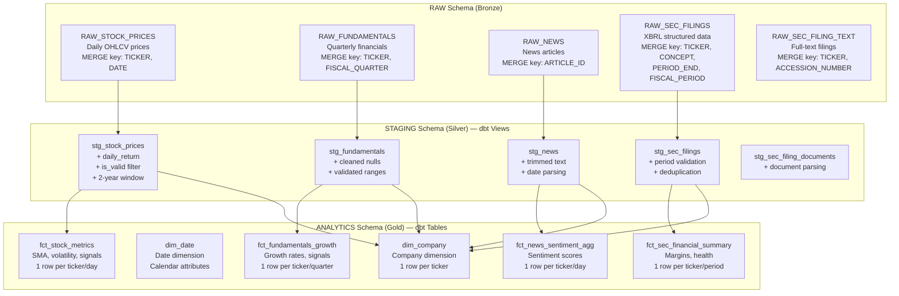
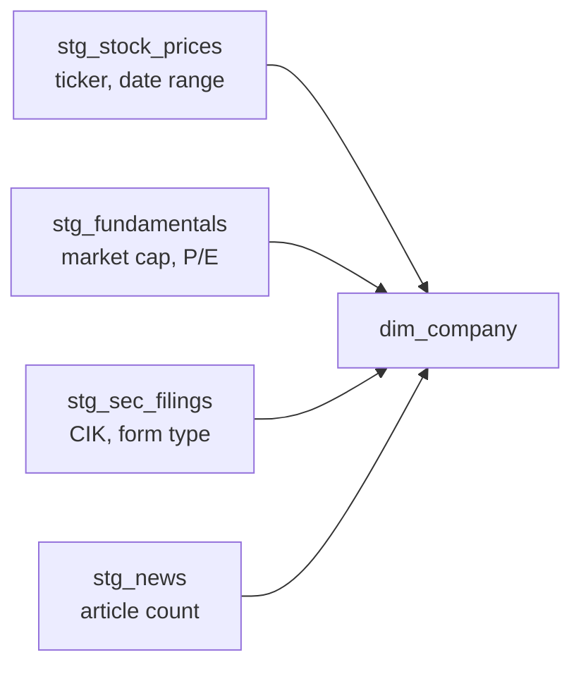
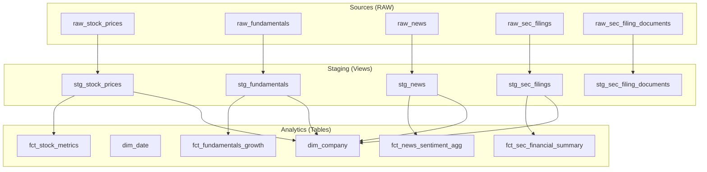

# Snowflake Warehouse Architecture

## What It Does

FinSage uses a three-layer medallion architecture in Snowflake: RAW (bronze) for ingested data, STAGING (silver) for cleaned/validated views, and ANALYTICS (gold) for business-ready fact and dimension tables with derived signals.

---

## Three-Layer Architecture Overview



---

## Why This Architecture

| Design Choice | Rationale |
|--------------|-----------|
| **Three layers** | Each layer has a clear responsibility: RAW preserves source fidelity, STAGING cleans, ANALYTICS derives business value |
| **Staging = views** | Views are always fresh (computed on read), zero storage cost, and always reflect the latest RAW data |
| **Analytics = tables** | Materialized for query performance — SMA, volatility, and signal calculations are expensive window functions |
| **Separate schemas** | Clear ownership boundaries; staging can be rebuilt from RAW, analytics from staging |
| **Derived signals** | Categorical signals (BULLISH/BEARISH) enable non-technical users to understand data without interpreting numbers |

---

## RAW Layer — Source of Truth

All 5 RAW tables share these columns:

| Column | Type | Purpose |
|--------|------|---------|
| `TICKER` | VARCHAR | Company identifier |
| `SOURCE` | VARCHAR | Origin system (yahoo_finance, alpha_vantage, etc.) |
| `INGESTED_AT` | TIMESTAMP | When the record was loaded |
| `DATA_QUALITY_SCORE` | FLOAT | 0-100 quality score computed pre-load |

**Key properties:**
- Immutable source records (updates via MERGE preserve latest version)
- No business logic or transformations
- Full history retention

---

## STAGING Layer — Data Cleaning (dbt Views)

### stg_stock_prices

```sql
-- Key transformations
daily_return = (close - LAG(close) OVER (PARTITION BY ticker ORDER BY date)) 
               / NULLIF(LAG(close) OVER (...), 0)

is_valid = (close IS NOT NULL 
            AND volume >= 0 
            AND close > 0 
            AND high >= low)

-- Filter: only last 2 years, only valid records
WHERE date >= DATEADD(year, -2, CURRENT_DATE())
  AND is_valid = TRUE
```

**Why filter to 2 years?** Keeps analytics tables manageable and relevant. Historical data beyond 2 years adds noise to moving averages without improving signal quality.

### stg_fundamentals
- Validates non-null revenue and EPS
- Parses fiscal quarter format
- Filters to valid time ranges

### stg_news
- Trims article text
- Parses publication timestamps
- Removes duplicate articles by ID

### stg_sec_filings
- Validates XBRL concepts against known US-GAAP taxonomy
- Deduplicates on compound key (keeps latest `filed_date`)
- Filters to valid fiscal periods: Q1, Q2, Q3, FY

---

## ANALYTICS Layer — Business Logic (dbt Tables)

### dim_company — Company Dimension



**Grain:** 1 row per ticker (slowly-changing dimension)

**Derived columns:**
| Column | Logic |
|--------|-------|
| `MARKET_CAP_CATEGORY` | MEGA_CAP (>$200B), LARGE_CAP (>$10B), MID_CAP (>$2B), SMALL_CAP (>$300M), MICRO_CAP |
| `DATA_SOURCES_AVAILABLE` | Count of source tables with data (0-4) |
| `FIRST_PRICE_DATE` / `LAST_PRICE_DATE` | Trading history range |
| `TRADING_DAYS` | Count of valid trading days |

### fct_stock_metrics — Technical Indicators

**Grain:** 1 row per ticker per trading day

| Metric | Calculation | Window |
|--------|------------|--------|
| `SMA_7D` | Simple moving average | 7 trading days |
| `SMA_30D` | Simple moving average | 30 trading days |
| `SMA_90D` | Simple moving average | 90 trading days |
| `VOLATILITY_30D` | STDDEV(daily_return) | 30 trading days |
| `AVG_VOLUME_30D` | AVG(volume) | 30 trading days |
| `HIGH_52W` / `LOW_52W` | MAX/MIN(close) | 251 trading days |
| `PRICE_POSITION_52W` | (close - low_52w) / (high_52w - low_52w) | Derived |
| `DAILY_RANGE_PCT` | (high - low) / close | Single day |

**Signal derivation:**
```sql
TREND_SIGNAL = CASE
    WHEN close > sma_30d AND sma_7d > sma_30d THEN 'BULLISH'
    WHEN close < sma_30d AND sma_7d < sma_30d THEN 'BEARISH'
    ELSE 'NEUTRAL'
END
```

### fct_fundamentals_growth — Financial Growth

**Grain:** 1 row per ticker per fiscal quarter

| Metric | Calculation |
|--------|------------|
| `REVENUE_GROWTH_YOY` | (revenue - LAG(revenue, 4)) / LAG(revenue, 4) |
| `NET_INCOME_GROWTH_YOY` | Same pattern |
| `EPS_GROWTH_YOY` | Same pattern |

**Signal derivation:**
```sql
FUNDAMENTAL_SIGNAL = CASE
    WHEN revenue_growth_yoy > 0.10 AND net_income_growth_yoy > 0.10 THEN 'STRONG_GROWTH'
    WHEN revenue_growth_yoy > 0 THEN 'MODERATE_GROWTH'
    WHEN revenue_growth_yoy < -0.05 THEN 'DECLINING'
    ELSE 'MIXED'
END
```

### fct_news_sentiment_agg — Sentiment Analysis

**Grain:** 1 row per ticker per day

| Metric | Source |
|--------|--------|
| `AVG_SENTIMENT` | Mean of article sentiment scores |
| `ARTICLE_COUNT` | Count of articles per day |
| `SENTIMENT_7D_AVG` | 7-day rolling average sentiment |
| `POSITIVE_COUNT` / `NEGATIVE_COUNT` | Breakdown by polarity |

**Signal derivation:**
```sql
SENTIMENT_LABEL = CASE
    WHEN sentiment_7d_avg > 0.2 THEN 'BULLISH'
    WHEN sentiment_7d_avg < -0.2 THEN 'BEARISH'
    WHEN article_count = 0 THEN 'NO_COVERAGE'
    ELSE 'NEUTRAL'
END
```

### fct_sec_financial_summary — SEC Financials

**Grain:** 1 row per ticker per fiscal year/period

| Metric | Source XBRL Concept |
|--------|-------------------|
| `TOTAL_REVENUE` | Revenues |
| `NET_INCOME` | NetIncomeLoss |
| `TOTAL_ASSETS` | Assets |
| `TOTAL_LIABILITIES` | Liabilities |
| `NET_PROFIT_MARGIN` | net_income / revenue |
| `OPERATING_MARGIN` | operating_income / revenue |
| `DEBT_TO_EQUITY` | liabilities / equity |
| `ROE` | net_income / equity |

**Signal derivation:**
```sql
FINANCIAL_HEALTH = CASE
    WHEN net_profit_margin > 0.15 AND debt_to_equity < 1.0 THEN 'EXCELLENT'
    WHEN net_profit_margin > 0.05 THEN 'HEALTHY'
    WHEN net_profit_margin > 0 THEN 'FAIR'
    ELSE 'UNPROFITABLE'
END
```

---

## Signal Summary Table

| Signal | Values | Based On |
|--------|--------|----------|
| `TREND_SIGNAL` | BULLISH, BEARISH, NEUTRAL | Price vs 30-day SMA, 7-day vs 30-day SMA |
| `FUNDAMENTAL_SIGNAL` | STRONG_GROWTH, MODERATE_GROWTH, DECLINING, MIXED | YoY revenue and net income growth |
| `SENTIMENT_LABEL` | BULLISH, BEARISH, NEUTRAL, NO_COVERAGE | 7-day average sentiment score |
| `FINANCIAL_HEALTH` | EXCELLENT, HEALTHY, FAIR, UNPROFITABLE | Net profit margin and D/E ratio |

These signals are consumed by:
1. **CAVM Report Agent** — Maps to BUY/HOLD/SELL recommendations
2. **Frontend SignalBadge** — Color-coded display (green/yellow/red/gray)
3. **Analysis Agent** — Used as context for LLM-generated narratives

---

## dbt Model Dependency Graph



---

## dbt Testing Strategy

| Test Type | Applied To | Purpose |
|-----------|-----------|---------|
| `not_null` | All primary keys, critical metrics | Ensure no missing identifiers |
| `unique` | Compound keys (ticker + date) | Prevent duplicates in analytics |
| `accepted_values` | Signal columns | Only valid signal values (BULLISH, BEARISH, etc.) |
| `relationships` | Fact tables → dim_company | Referential integrity |

---

## Q&A for This Section

**Q: Why not use Snowflake Streams and Tasks instead of dbt?**
A: dbt provides SQL-based transformations with built-in testing, documentation, and lineage. Snowflake Streams/Tasks are better for event-driven CDC, which isn't our loading pattern.

**Q: Why are staging models views instead of tables?**
A: Staging logic is lightweight (filtering, type casting). Views eliminate storage cost and are always consistent with RAW data — no separate refresh needed.

**Q: Why derive categorical signals instead of just storing numbers?**
A: Signals serve two audiences: (1) non-technical users who need quick assessments, and (2) the Report Agent which maps signals to investment recommendations (BUY/HOLD/SELL).

**Q: How do you handle late-arriving data?**
A: The MERGE pattern handles this naturally. If a record arrives late, it either inserts (new key) or updates (existing key). dbt rebuilds analytics tables from staging views, so late data flows through automatically on the next `dbt run`.

**Q: What's the data freshness guarantee?**
A: Airflow runs at 5 PM EST daily (weekdays). The quality gate requires 25+ tickers with fresh data before dbt runs. Maximum staleness is 1 business day under normal operation.

---

*Previous: [02-data-pipeline-architecture.md](./02-data-pipeline-architecture.md) | Next: [04-cavm-pipeline-architecture.md](./04-cavm-pipeline-architecture.md)*
