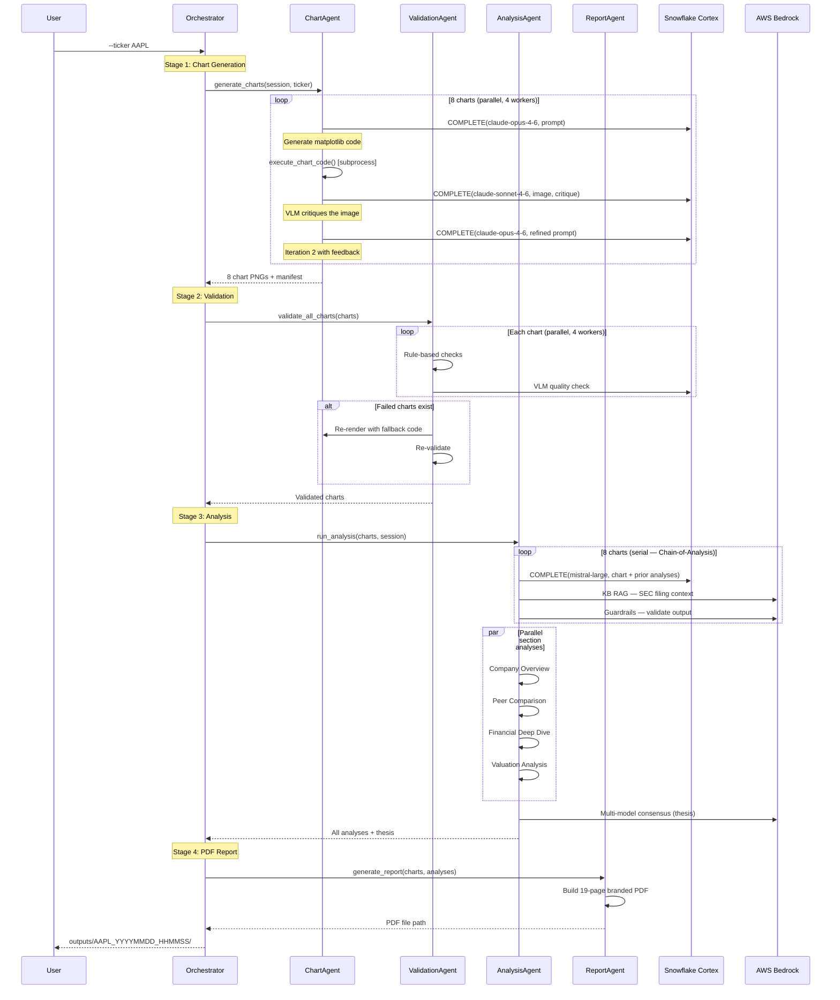
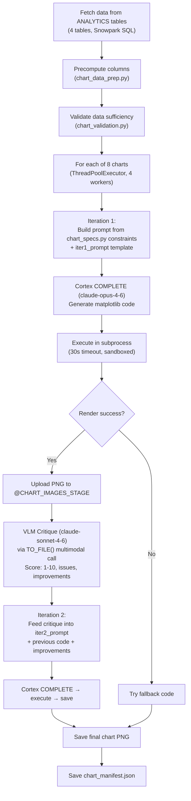
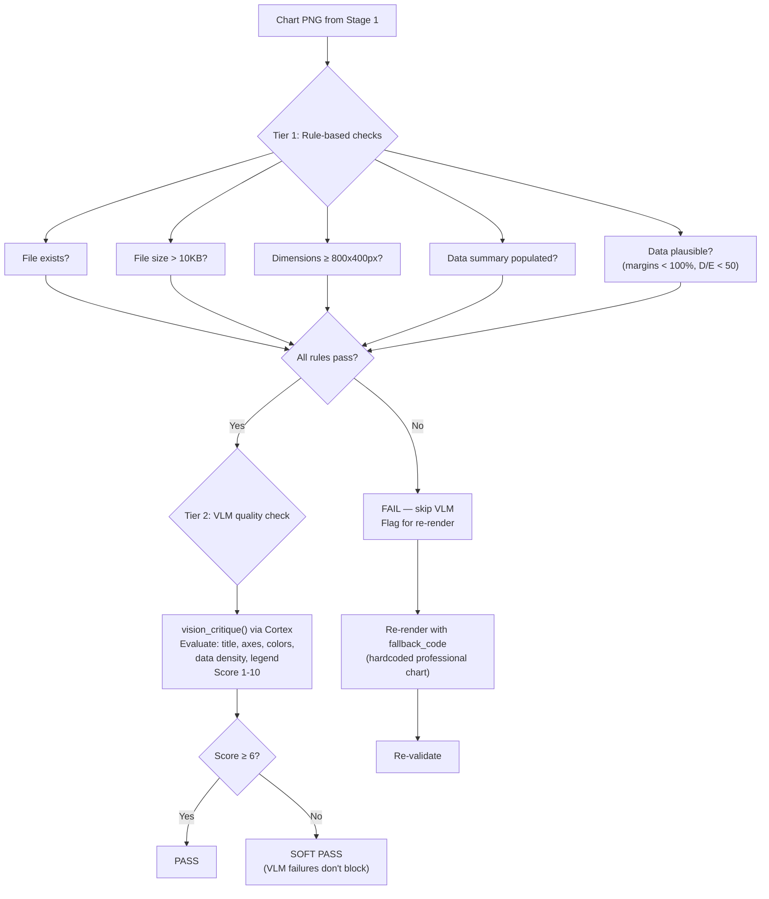
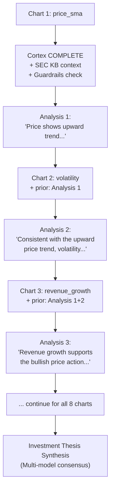
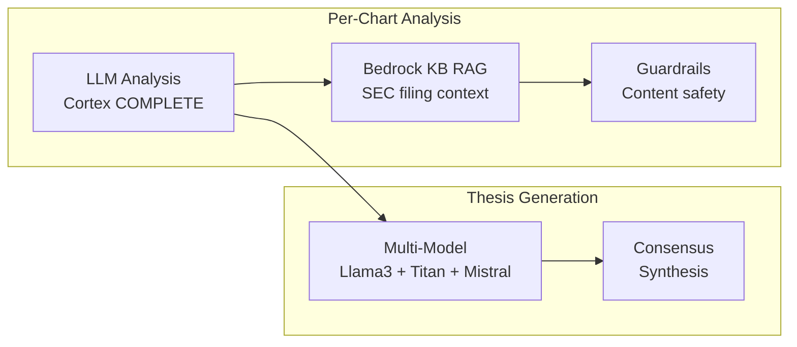
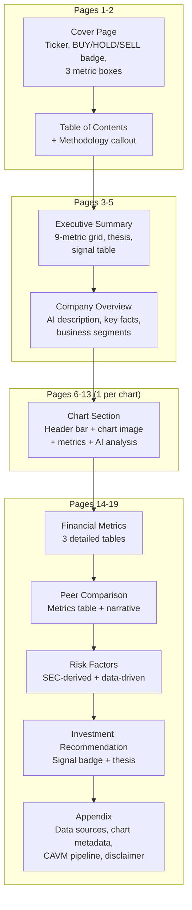
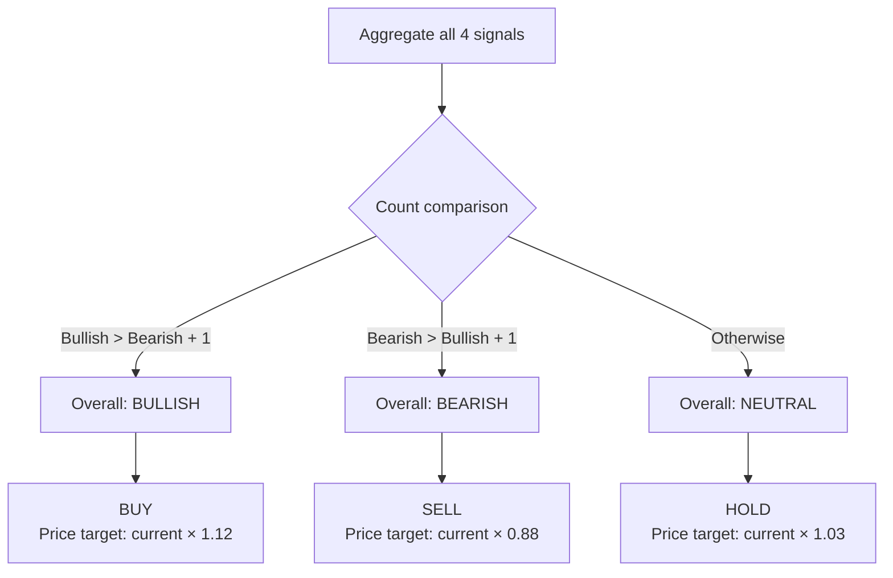
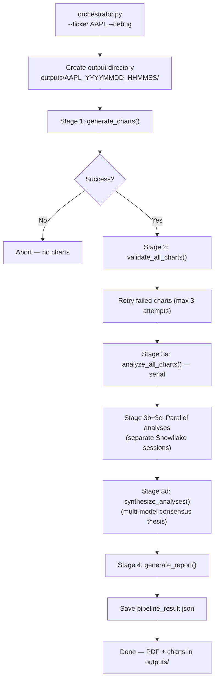

# CAVM Multi-Agent Pipeline Architecture

## What It Does

The CAVM (Chart-Analysis-Validation-Metrics) pipeline is a 4-agent system that generates branded equity research PDF reports. Given a ticker symbol, it produces 8 professional charts, validates their quality, generates AI-driven analysis with cross-referencing, and assembles a 15-20 page branded PDF.

**Entry point:** `python agents/orchestrator.py --ticker AAPL`

---

## Pipeline Overview

---

## Stage 1: Chart Agent — VLM Refinement Loop

### What: The Core Innovation

Instead of generating charts in a single pass, the Chart Agent uses a **multi-iteration refinement loop** where a Vision Language Model (VLM) critiques each chart image, and the feedback is fed back to improve the next iteration.

### How It Works

### Why VLM Refinement

| Problem | Solution |
|---------|----------|
| LLMs generate matplotlib code with visual bugs (overlapping labels, wrong colors, cut-off titles) | VLM sees the actual rendered image and provides specific feedback |
| Single-pass generation has ~60% visual quality rate | 2-iteration refinement improves to ~85%+ quality |
| VLM models can be unreliable | 3-tier VLM fallback: claude-sonnet-4-6 → pixtral-large → text-only critique |

### The 8 Charts

| Chart ID | Type | Data Source | Key Visuals |
|----------|------|-------------|-------------|
| `price_sma` | Line + fill | FCT_STOCK_METRICS | Close price + 3 SMA overlays (7/30/90d) |
| `volatility` | Dual-axis bar+line | FCT_STOCK_METRICS | Volume bars + volatility line |
| `revenue_growth` | Grouped bar | FCT_FUNDAMENTALS_GROWTH | YoY revenue vs net income growth |
| `eps_trend` | Dual-axis line+bar | FCT_FUNDAMENTALS_GROWTH | EPS trend line + growth bars |
| `financial_health` | Dual-axis bar+line | FCT_SEC_FINANCIAL_SUMMARY | Margin bars + D/E ratio line |
| `margin_trend` | Line + fill | FCT_SEC_FINANCIAL_SUMMARY | Net + operating margin trends |
| `balance_sheet` | Stacked bar + line | FCT_SEC_FINANCIAL_SUMMARY | Liabilities, equity stacked + assets line |
| `sentiment` | Line + fill zones | FCT_NEWS_SENTIMENT_AGG | 7-day avg sentiment with bullish/bearish zones |

### Chart Spec Constraints (chart_specs.py)

**Why:** The LLM's job is constrained to *arranging pre-defined data series into matplotlib code* — NOT computing or transforming data. This prevents hallucinated calculations.

Each chart spec defines:
- `chart_type` — matplotlib chart style
- `required_series` — exact column names to plot
- `required_visuals` — mandatory visual elements (legend, title, axis labels)
- `constraints` — hard rules (e.g., "do NOT reorder dates", "use exactly these colors")
- `precomputed_columns` — columns already calculated by `chart_data_prep.py`
- `figsize` — exact figure dimensions

### Code Execution Safety

LLM-generated matplotlib code runs in a **subprocess** with:
- 30-second execution timeout
- Known bad kwarg fixes (`fillalpha=` → `alpha=`, `lineStyle=` → `linestyle=`)
- Hallucinated matplotlib method removal
- Auto date-column conversion (epoch → datetime)
- Try/except wrapper for error capture

---

## Stage 2: Validation Agent — Two-Tier Quality Assurance

**Why VLM failures are soft passes:** VLM models are non-deterministic and occasionally return low scores for perfectly valid charts. Blocking report generation on VLM flakiness would make the pipeline unreliable.

---

## Stage 3: Analysis Agent — Chain-of-Analysis

### What: Progressive Narrative Building

Charts are analyzed **serially in a fixed order** (price → volatility → revenue → EPS → financial_health → margin_trend → balance_sheet → sentiment). Each analysis receives all prior analyses as context, creating a **progressive narrative** where later insights reference and build upon earlier findings.

### How It Works

### Why Chain-of-Analysis (not parallel)

| Parallel Analysis | Chain-of-Analysis |
|-------------------|-------------------|
| Each chart analyzed in isolation | Each analysis references prior findings |
| Disconnected bullet points | Coherent narrative with "consistent with..." and "in contrast to..." |
| No cross-chart insights | Divergences flagged as risks or opportunities |
| Faster but shallow | Slower but reads like a real analyst's report |

### Three Bedrock Integrations

| Integration | Purpose | Fallback |
|------------|---------|----------|
| **Bedrock KB RAG** | Enrich each chart analysis with relevant SEC filing excerpts | Skip — analysis proceeds without SEC context |
| **Guardrails** | Block investment advice, redact PII, detect hallucinations | Replace with fallback text |
| **Multi-Model** | Generate consensus investment thesis from multiple LLMs | Single Cortex call |

### Parallel Section Analyses (Stage 3b/3c)

After the serial chart analyses, 4 additional sections run in parallel using separate Snowflake sessions:

| Section | Content | Data Source |
|---------|---------|-------------|
| Company Overview | AI description, business segments, competitive landscape | DIM_COMPANY + KB |
| Peer Comparison | Metrics comparison vs industry peers | Resolved via yfinance/sector defaults |
| Financial Deep Dive | Multi-quarter trend analysis | FCT_SEC_FINANCIAL_SUMMARY |
| Valuation Analysis | Relative valuation multiples vs peers | Multiple analytics tables |

---

## Stage 4: Report Agent — Branded PDF Assembly

### PDF Structure (19 pages)

### Midnight Teal Color Scheme

| Color | Hex | Usage |
|-------|-----|-------|
| Dark | `#0f2027` | Header/footer backgrounds |
| Teal | `#00b4d8` | Accent lines, section headers |
| Bullish | `#06d6a0` | Positive signals, BUY recommendation |
| Bearish | `#ef476f` | Negative signals, SELL recommendation |
| Neutral | `#94a3b8` | Neutral/HOLD signals |

### Signal-to-Recommendation Mapping

---

## Orchestrator Coordination

**Key design decisions:**
- **Separate Snowflake sessions for parallel Stage 3**: Snowpark sessions aren't thread-safe, so parallel sections get their own sessions
- **`--skip-charts` flag**: Reuse charts from a previous run for faster iteration on analysis/report changes
- **`--debug` flag**: Extra logging, intermediate file preservation

---

## Q&A for This Section

**Q: Why 4 separate agents instead of one monolithic script?**
A: Each agent has a distinct responsibility and failure mode. Chart generation can fail independently of analysis. Validation can trigger re-renders. This separation enables retry logic at each stage and makes debugging easier.

**Q: Why use Snowflake Cortex instead of calling OpenAI/Anthropic directly?**
A: Cortex runs inside Snowflake — no API keys, no data leaves the warehouse, lower latency for data-proximate inference. The SQL interface (`SELECT CORTEX.COMPLETE(...)`) integrates naturally with the Snowpark-based pipeline.

**Q: Why not use LangChain or CrewAI for the multi-agent pipeline?**
A: The CAVM pipeline has a fixed, linear flow (Chart → Validate → Analyze → Report). Agent frameworks add abstraction overhead for what is fundamentally a sequential pipeline with targeted parallelism. Direct Python orchestration is simpler and more debuggable.

**Q: How long does the full pipeline take?**
A: Typically 5-15 minutes per ticker. Chart generation (with VLM refinement) is the bottleneck. The `--skip-charts` flag reduces subsequent runs to 2-5 minutes.

**Q: What happens if a chart completely fails?**
A: The hardcoded `fallback_code` in `CHART_DEFINITIONS` produces a professional-looking chart without any LLM involvement. This ensures the report always has complete visualizations.

---

*Previous: [03-snowflake-warehouse-architecture.md](./03-snowflake-warehouse-architecture.md) | Next: [05-sec-filing-pipeline.md](./05-sec-filing-pipeline.md)*
