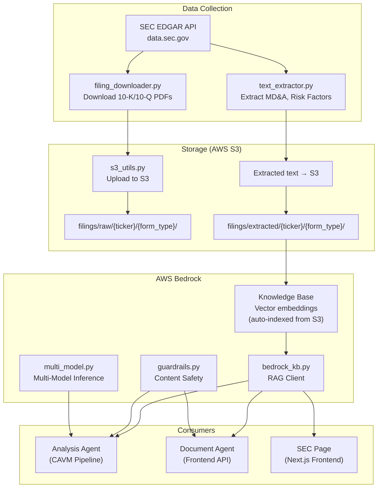
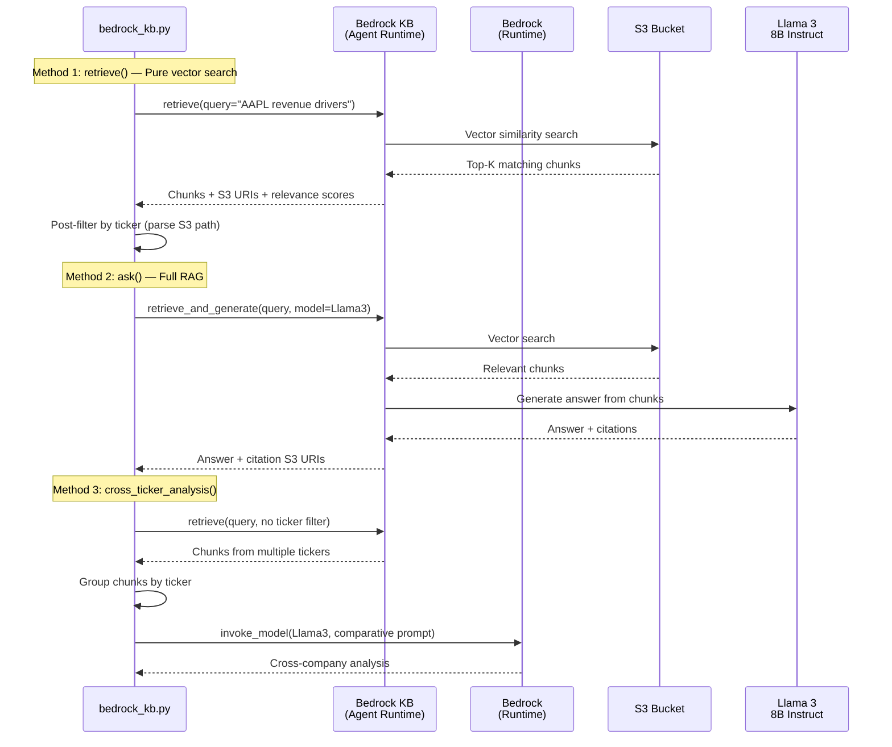
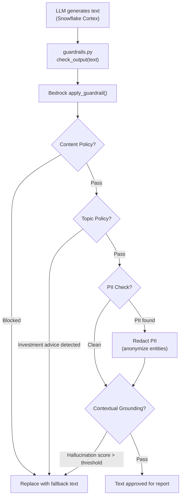
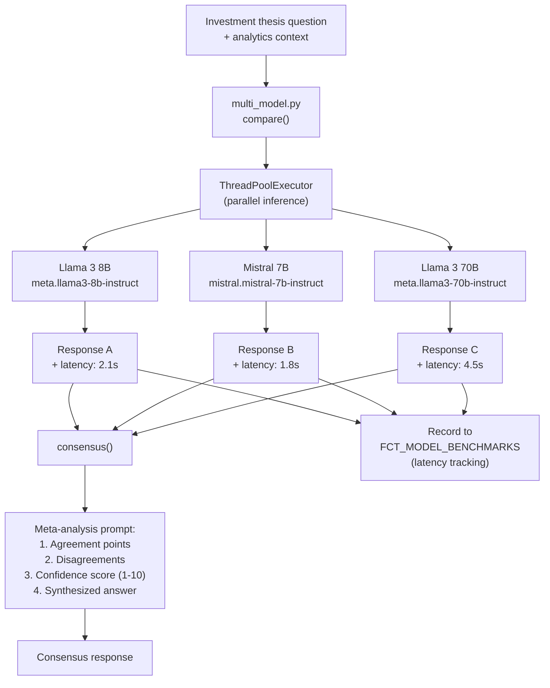
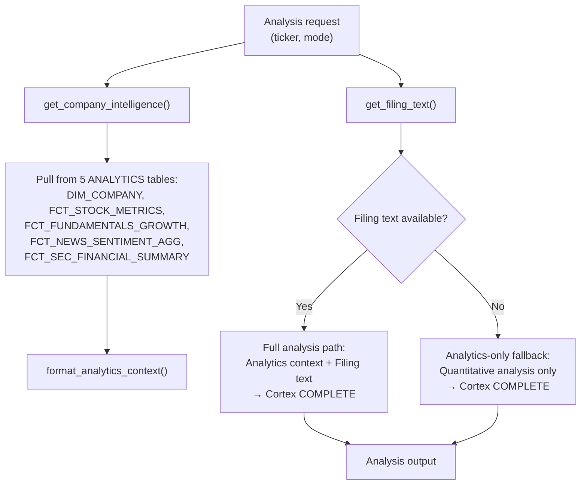
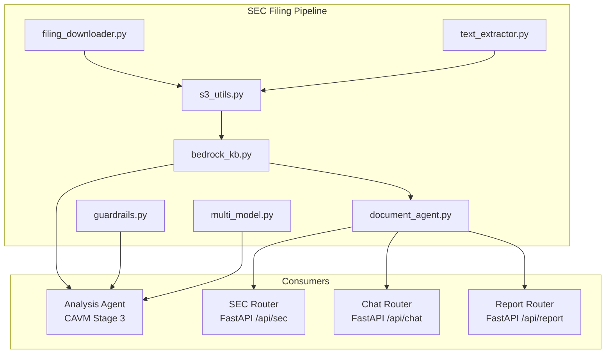

# SEC Filing Pipeline & AWS Bedrock Integration

## What It Does

The SEC filing pipeline downloads 10-K and 10-Q filings from SEC EDGAR, stores them in S3, indexes them in an AWS Bedrock Knowledge Base for RAG (Retrieval-Augmented Generation), and wraps them with Guardrails for content safety and multi-model inference for consensus analysis.

---

## End-to-End Pipeline



---

## S3 Storage Architecture

```
finsage-sec-filings-808683/
├── filings/
│   ├── raw/                          # Original filing documents
│   │   ├── AAPL/
│   │   │   ├── 10-K/
│   │   │   │   ├── 2024-Q4.pdf
│   │   │   │   └── 2023-Q4.pdf
│   │   │   └── 10-Q/
│   │   │       ├── 2024-Q3.pdf
│   │   │       └── 2024-Q2.pdf
│   │   ├── MSFT/
│   │   └── ...
│   ├── extracted/                    # Parsed text for Bedrock KB indexing
│   │   ├── AAPL/
│   │   │   ├── 10-K/
│   │   │   │   ├── mda_2024.txt      # Management Discussion & Analysis
│   │   │   │   └── risks_2024.txt    # Risk Factors
│   │   │   └── 10-Q/
│   │   └── ...
│   └── metadata/                     # Filing metadata (JSON)
```

### S3 Lifecycle Rules

| Rule | Target | Action | Why |
|------|--------|--------|-----|
| Raw → Infrequent Access | `filings/raw/` after 90 days | Storage class transition | Raw filings rarely re-read after initial processing |
| Extracted → IA | `filings/extracted/` after 180 days | Storage class transition | Text files accessed via Bedrock KB, not directly |
| Old versions expire | All prefixes after 30 days | Delete old versions | Versioning enabled for safety, but old versions not needed |

---

## Bedrock Knowledge Base — RAG Architecture

### What: Vector Search over SEC Filings

The Bedrock Knowledge Base automatically indexes text files from S3, creates vector embeddings, and enables semantic search + retrieval-augmented generation.

### How It Works



### Why Post-Retrieval Ticker Filtering

Bedrock KB's vector search is **semantic**, not metadata-filtered. A query about "AAPL revenue" might return chunks from MSFT filings that also discuss revenue. The `retrieve()` method:

1. Prepends the ticker to the query ("AAPL: revenue drivers") for relevance boost
2. Fetches `max_results × 3` chunks to account for filtering loss
3. Parses S3 URIs to extract ticker from path: `filings/extracted/{TICKER}/...`
4. Post-filters to only return chunks matching the requested ticker

---

## Guardrails — Content Safety

### What: Financial Compliance + Hallucination Detection

Bedrock Guardrails validates all LLM output before it enters the report. This is critical for financial content where investment advice and PII are regulated.

### How It Works



### Four Assessment Types

| Assessment | What It Checks | Action on Failure |
|-----------|---------------|-------------------|
| **Content Policy** | Blocked content types (explicit, harmful) | Replace entire text with guardrail fallback |
| **Topic Policy** | Denied topics — specifically "investment advice" | Replace with disclaimer text |
| **PII Detection** | Names, emails, phone numbers, SSNs | Anonymize/redact specific entities |
| **Contextual Grounding** | Hallucination score (is the text grounded in source data?) | Replace if confidence below threshold |

### Why check_output() Instead of generate()

The analysis text is generated by **Snowflake Cortex** (not Bedrock). Guardrails are applied **post-hoc** via the `apply_guardrail()` API — this validates existing text without calling an LLM. This avoids:
- Double model invocation cost
- Latency of a second LLM call
- Dependency on Bedrock availability for text generation

---

## Multi-Model Inference — Consensus Analysis

### What: Cross-Model Verification

For critical analysis sections (investment thesis), the same question is sent to multiple LLMs. Their responses are synthesized to identify agreement points, disagreements, and confidence levels.

### How It Works



### Provider-Specific Request Formats

| Provider | Format | Key Differences |
|----------|--------|-----------------|
| **Llama** | Chat template with `<\|begin_of_text\|>` markers | `max_gen_len` parameter |
| **Titan** | `inputText` + `textGenerationConfig` | Amazon-specific format |
| **Mistral** | `[INST]` markers | `max_tokens` parameter |
| **Claude** | Messages API | `anthropic_version` required |

### Why Multi-Model Consensus

| Single Model | Multi-Model Consensus |
|-------------|----------------------|
| Single perspective, potential model bias | Multiple perspectives, reduces individual bias |
| No confidence measure | Confidence score based on agreement level |
| Can hallucinate without detection | Disagreements flag potential hallucinations |
| Fast | Slower but more reliable for high-stakes recommendations |

---

## Document Agent — Unified Analysis Interface

### What

The Document Agent (`scripts/sec_filings/document_agent.py`) is the central AI brain that combines Snowflake analytics data with SEC filing text for comprehensive analysis. It serves both the CAVM pipeline and the frontend API.

### How: Dual-Path Analysis



### 5 Analysis Modes

| Mode | Function | What It Does |
|------|----------|-------------|
| **Summary** | `summarize_filing()` | Executive summary cross-referencing numbers with MD&A |
| **Risk** | `analyze_risks()` | Risk analysis weighted by actual quantitative metrics |
| **MD&A** | `analyze_mda()` | Verifies management claims against actual numbers |
| **Compare** | `compare_filings()` | Trend-aware comparison of 2 filing periods + current data |
| **Q&A** | `ask_question()` | Open-ended question answering with full context |

---

## Integration Points Summary



---

## Q&A for This Section

**Q: Why S3 + Bedrock KB instead of building your own vector database?**
A: Bedrock KB is a managed service that handles embedding generation, vector storage, and retrieval. Building a custom vector DB (Pinecone, Weaviate, etc.) would require additional infrastructure management and embedding pipeline maintenance.

**Q: Why Llama 3 for RAG instead of Claude or GPT?**
A: Llama 3 is available via Bedrock with no additional API keys. The 8B Instruct model is cost-effective for RAG (where the context provides most of the answer quality). For chart analysis, we use Snowflake Cortex (claude-opus-4-6) for higher quality.

**Q: Why apply guardrails post-hoc instead of during generation?**
A: Text is generated by Snowflake Cortex, not Bedrock. Applying guardrails during generation would require switching to a Bedrock model, adding latency and cost. The `apply_guardrail()` API validates text without a model call.

**Q: How do you handle the SEC's rate limits?**
A: SEC EDGAR requires a User-Agent header with contact info and recommends max 10 requests/second. We use 0.3s delays between requests and respect their API guidelines.

**Q: What if Bedrock KB is unavailable?**
A: Every Bedrock integration has a fallback. KB RAG failures result in analysis without SEC context. Guardrail failures result in text being included without validation. Multi-model failures fall back to a single Cortex call.

---

*Previous: [04-cavm-pipeline-architecture.md](./04-cavm-pipeline-architecture.md) | Next: [06-frontend-architecture.md](./06-frontend-architecture.md)*
