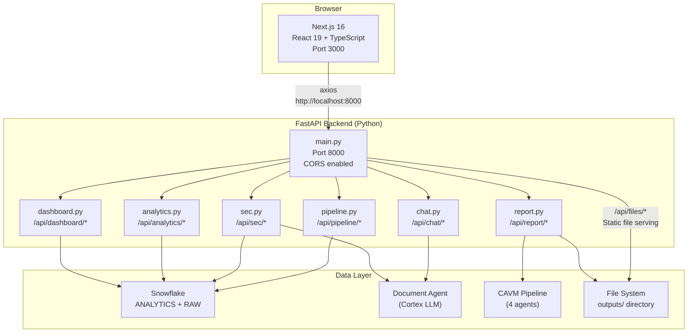
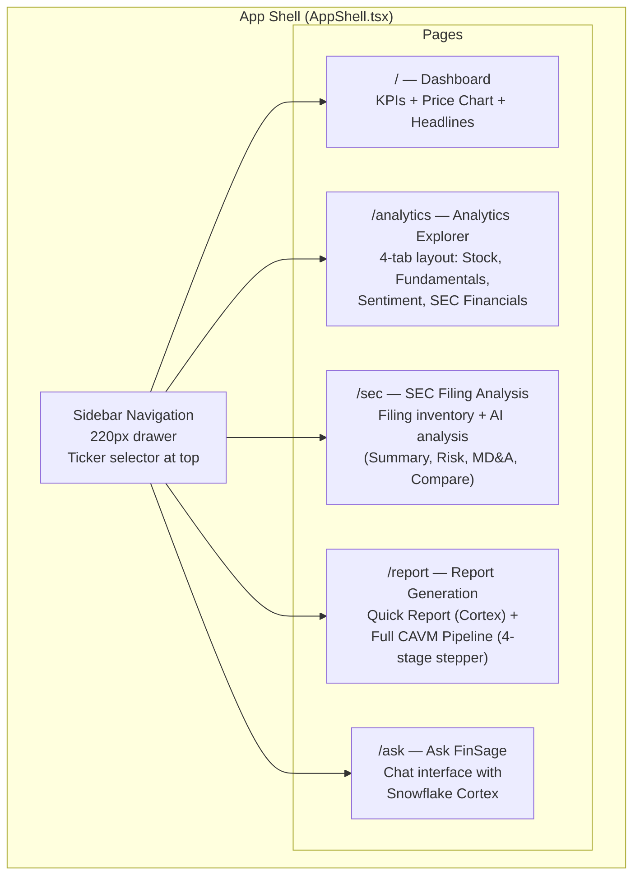
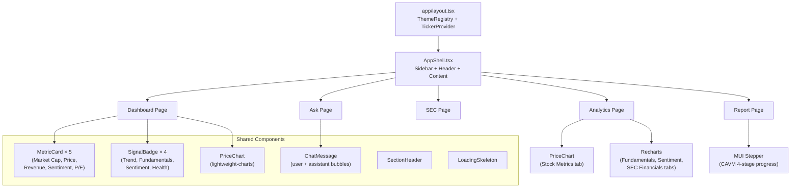
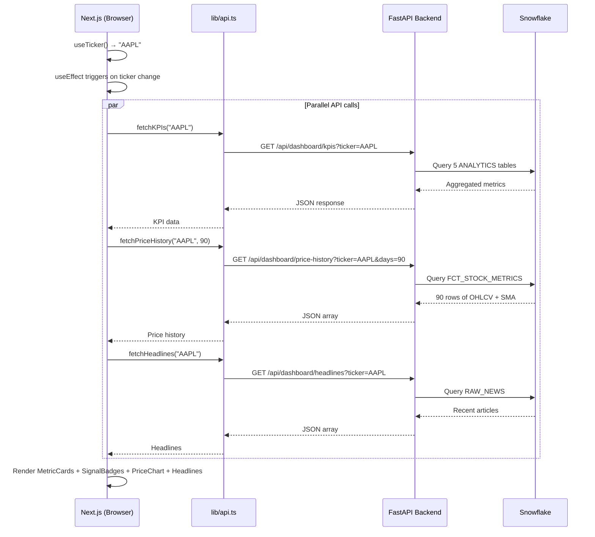
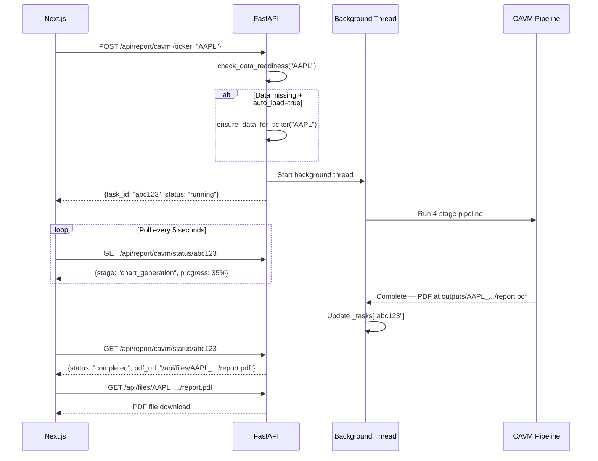
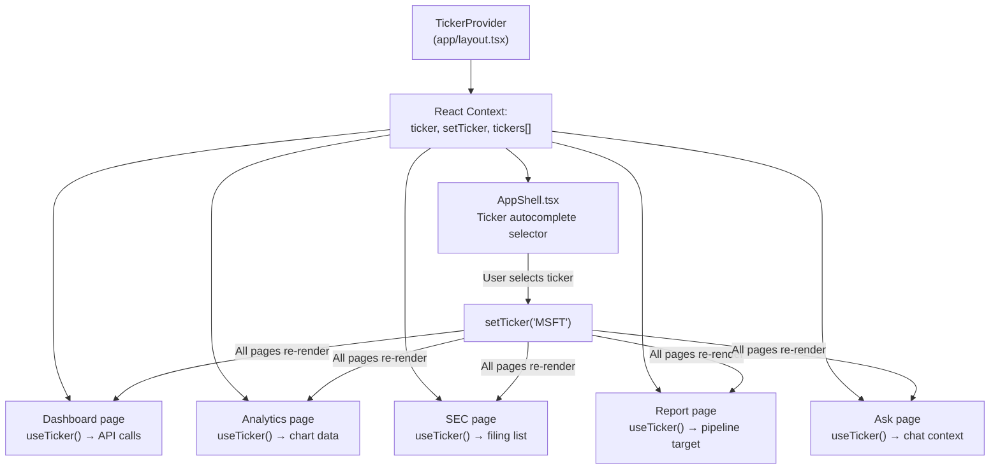

# Frontend Architecture — Next.js + FastAPI

## What It Does

FinSage has a modern web frontend with a Next.js 16 React app (5 pages) that communicates with a FastAPI Python backend (6 REST routers). The backend queries Snowflake directly via Snowpark sessions and triggers the CAVM pipeline for report generation.

---

## Architecture Overview

---

## Frontend Page Map

---

## Component Hierarchy

---

## Design System — "Fancy Flirt" Theme

### Color Palette

| Color | Name | Hex | Usage |
|-------|------|-----|-------|
|  | Star Command Blue | `#0382B7` | Primary / interactive elements / price line |
|  | Rare Jade | `#9DCBB8` | Success / bullish signals |
|  | Super Pink | `#C96BAE` | Accent / active navigation / section borders |
|  | Trendy Coral | `#E58B6D` | Warning / bearish signals |
|  | Sky Yellow | `#F8CB86` | Highlights / chart accents |
|  | Background | `#FAFAF7` | Warm off-white page background |

### Typography

| Style | Font | Usage |
|-------|------|-------|
| Headings | **DM Serif Display** (serif) | Page titles, metric values, section headers |
| Body | **DM Sans** (sans-serif) | Body text, labels, navigation |

**Why this design:** An editorial, warm aesthetic that differentiates from typical blue-on-white tech dashboards. The serif headings give a financial report feel, while the warm colors create a premium, approachable interface.

### Component Styling

| Component | Style Details |
|-----------|--------------|
| **Cards** | White background, `#E8E4DB` border, subtle shadow, 10px radius |
| **Buttons** | Pink → Blue gradient for primary, 8px radius |
| **Sidebar** | `#F2F0EB` background, pink active indicator |
| **SignalBadge** | Color-coded chips: jade (bullish), yellow (neutral), gray (no data), coral (bearish) |
| **MetricCard** | Gradient top border (pink → blue), large serif value, delta with trend arrow |

---

## API Endpoint Map

### Dashboard Router (`/api/dashboard/`)

| Endpoint | Method | Response | Data Source |
|----------|--------|----------|-------------|
| `/kpis` | GET | Market cap, price, revenue, sentiment, P/E, 4 signals | 5 ANALYTICS tables |
| `/price-history` | GET | OHLCV + SMA data (N days) | FCT_STOCK_METRICS |
| `/headlines` | GET | Recent news titles with dates | RAW_NEWS |

### Analytics Router (`/api/analytics/`)

| Endpoint | Method | Response | Data Source |
|----------|--------|----------|-------------|
| `/stock-metrics` | GET | OHLCV, SMAs, volatility, trend signal | FCT_STOCK_METRICS |
| `/fundamentals` | GET | Revenue, EPS, growth rates, signal | FCT_FUNDAMENTALS_GROWTH |
| `/sentiment` | GET | Scores, article counts, 7D avg, trend | FCT_NEWS_SENTIMENT_AGG |
| `/sec-financials` | GET | Margins, ROE, D/E, health signal | FCT_SEC_FINANCIAL_SUMMARY |

### SEC Router (`/api/sec/`)

| Endpoint | Method | Response | Data Source |
|----------|--------|----------|-------------|
| `/filings` | GET | Filing inventory list | RAW_SEC_FILING_DOCUMENTS → RAW_SEC_FILINGS (fallback) |
| `/analyze` | POST | AI analysis (4 modes) | Document Agent + Cortex |

### Report Router (`/api/report/`)

| Endpoint | Method | Response | Data Source |
|----------|--------|----------|-------------|
| `/quick` | POST | Markdown report (synchronous) | Document Agent |
| `/cavm` | POST | Task ID (async pipeline start) | CAVM Pipeline (background thread) |
| `/cavm/status/{id}` | GET | Pipeline progress + PDF URL | In-memory task store |
| `/download/{file}` | GET | PDF file download | outputs/ directory |

### Chat Router (`/api/chat/`)

| Endpoint | Method | Response | Data Source |
|----------|--------|----------|-------------|
| `/ask` | POST | AI answer with citations | Document Agent + Cortex |

### Pipeline Router (`/api/pipeline/`)

| Endpoint | Method | Response | Data Source |
|----------|--------|----------|-------------|
| `/readiness` | POST | Data availability check | RAW/ANALYTICS tables |
| `/load` | POST | Task ID (async data load) | Data loaders (background) |
| `/load/status/{id}` | GET | Load job progress | In-memory task store |

---

## Data Flow: Dashboard Page Example

---

## CAVM Pipeline — Async Flow

---

## Ticker Context — App-Wide State

**How it works:**
1. On mount, fetches available tickers from `/api/tickers`
2. Default: AAPL, with fallback list `['AAPL', 'GOOGL', 'JPM', 'MSFT', 'TSLA']`
3. Input sanitization: strips non-alphanumeric, uppercases
4. Dynamically adds new tickers to the suggestion list when typed

---

## Q&A for This Section

**Q: Why a separate FastAPI backend instead of Next.js API routes?**
A: The backend needs Snowflake Snowpark (Python), data loaders (Python), and the CAVM pipeline (Python). Keeping the Python backend separate avoids complex Python-in-Node bridges and lets the data team work in their native language.

**Q: Why not use WebSockets for the CAVM progress updates?**
A: Polling every 5 seconds is simple and sufficient for a 5-15 minute pipeline. WebSockets would add connection management complexity for minimal UX improvement.

**Q: How do you handle the 5-15 minute CAVM pipeline without the request timing out?**
A: The CAVM pipeline runs in a background thread. The API immediately returns a `task_id`, and the frontend polls for status. This is the async task pattern — no long HTTP connections.

**Q: Why MUI instead of Tailwind or Chakra UI?**
A: MUI provides a comprehensive component library (DataGrid, Stepper, Autocomplete, Drawer) that would take significant effort to build from scratch with Tailwind. The theme system allows full customization of the editorial design.

**Q: Why lightweight-charts for the price chart?**
A: lightweight-charts (by TradingView) is purpose-built for financial OHLCV charts with high performance. Recharts and Chart.js lack native candlestick/financial chart support.

---

*Previous: [05-sec-filing-pipeline.md](./05-sec-filing-pipeline.md) | Next: [07-orchestration-architecture.md](./07-orchestration-architecture.md)*
