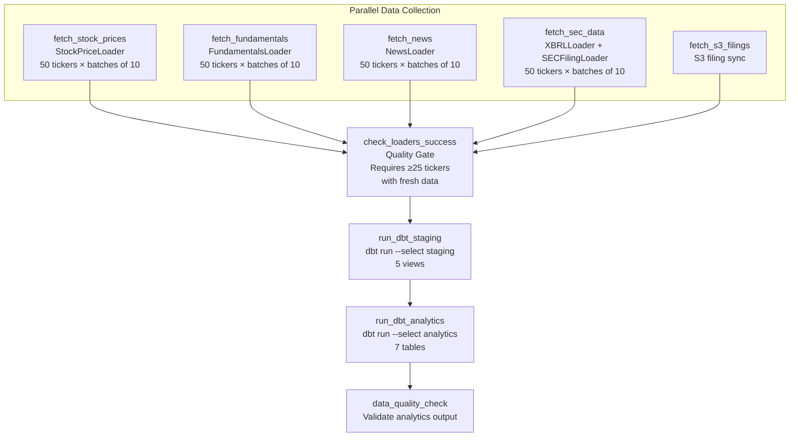
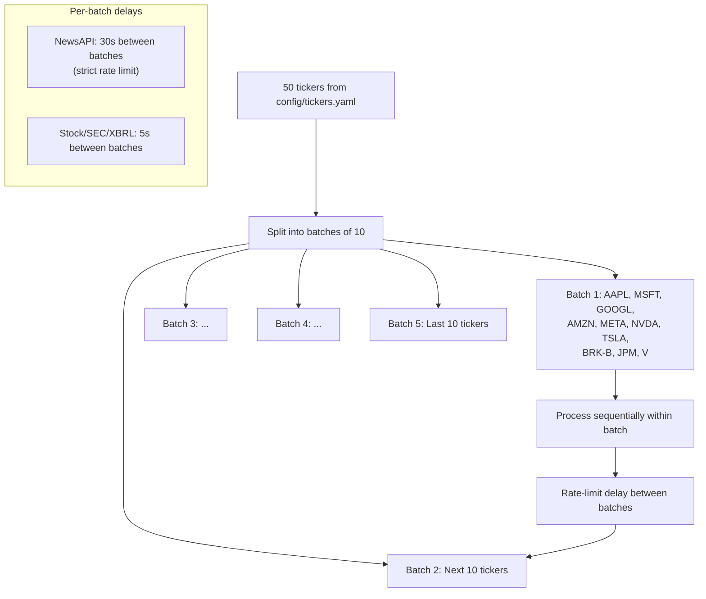
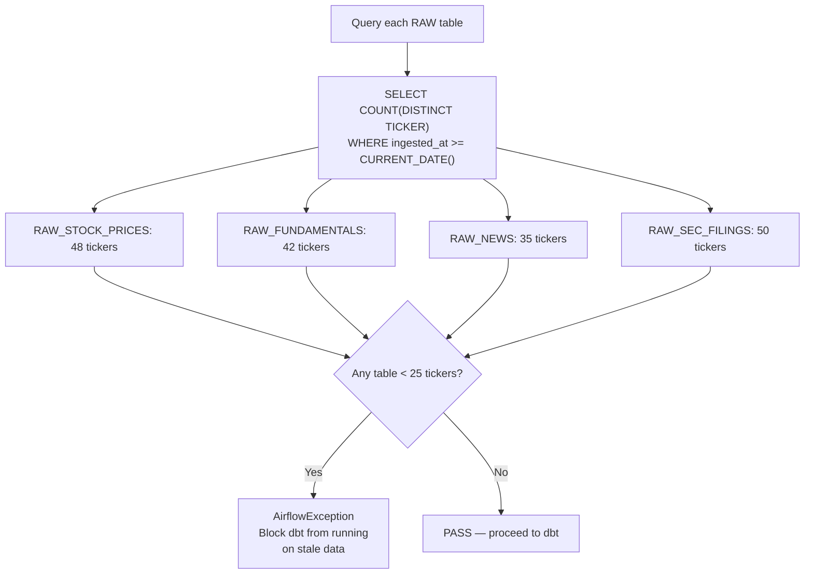
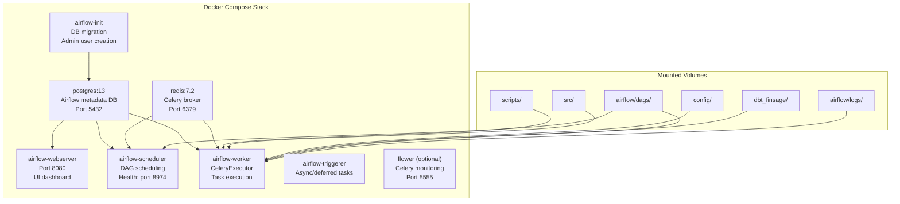
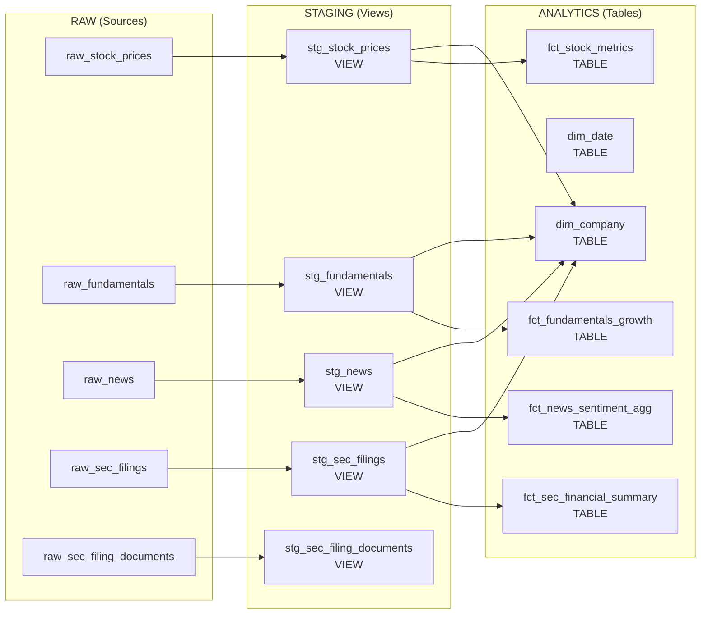
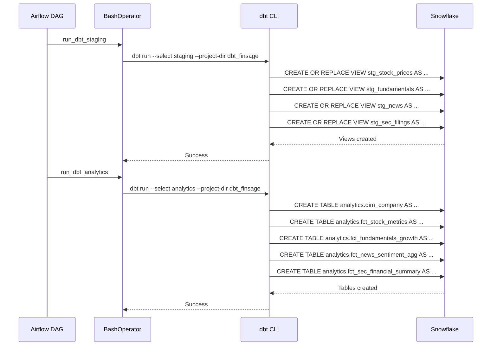

# Orchestration Architecture — Airflow & dbt

## What It Does

Apache Airflow schedules and monitors the daily data collection pipeline, while dbt handles SQL-based transformations from RAW to STAGING to ANALYTICS. Together, they ensure data is fresh, validated, and transformed on a predictable schedule.

---

## Airflow DAG Structure



---

## Schedule & Configuration

| Setting | Value | Why |
|---------|-------|-----|
| **Schedule** | `0 22 * * 1-5` (10 PM UTC / 5 PM EST) | After US market close (4 PM EST), with buffer for data availability |
| **Weekdays only** | Mon-Fri | No stock market data on weekends; saves API calls and compute |
| **Retries** | 3 attempts, 5-minute delay | External APIs can have transient failures |
| **Execution timeout** | 2 hours | Upper bound for full pipeline with 50 tickers |
| **CeleryExecutor** | Redis broker + PostgreSQL metadata | Enables parallel task execution across workers |

---

## Batch Processing Strategy



**Why batches of 10:** API rate limits vary by source. NewsAPI's free tier is the most restrictive (100 requests/day). Batching with delays prevents hitting rate limits while maximizing throughput.

---

## Quality Gate — check_loaders_success



**Why 25-ticker minimum:** At 50% coverage, the analytics tables would have enough data to be useful. Below that threshold, running dbt would produce misleading analytics (missing companies, incomplete signals).

**Why block dbt instead of proceeding with partial data:** Analysts rely on the ANALYTICS tables being comprehensive. Running dbt on 10 out of 50 tickers would make `dim_company` incomplete and `fct_stock_metrics` appear to show missing companies as having no data.

---

## Docker Compose Topology



### Container Resource Requirements

Checked by `airflow-init`:
- Minimum 4GB RAM
- Minimum 2 CPUs
- Minimum 10GB disk space

### Environment Variables Passed Through

```
SNOWFLAKE_ACCOUNT, SNOWFLAKE_USER, SNOWFLAKE_PASSWORD, SNOWFLAKE_DATABASE, SNOWFLAKE_WAREHOUSE
NEWSAPI_KEY, ALPHA_VANTAGE_API_KEY, SEC_USER_AGENT
AWS_ACCESS_KEY_ID, AWS_SECRET_ACCESS_KEY, AWS_DEFAULT_REGION
BEDROCK_KB_ID, BEDROCK_GUARDRAIL_ID
```

---

## dbt Transformation Pipeline

### Model Dependency Graph



### dbt Execution in Airflow



**Why separate dbt commands (staging then analytics):**
- Staging views must exist before analytics tables reference them
- If staging fails, analytics doesn't run (fail-fast)
- Allows retrying just one layer if needed

### dbt Testing Strategy

| Test Type | Example | Purpose |
|-----------|---------|---------|
| `not_null` | `ticker` in all tables | No missing identifiers |
| `unique` | `(ticker, date)` compound key | No duplicate rows |
| `accepted_values` | `trend_signal IN ('BULLISH', 'BEARISH', 'NEUTRAL')` | Only valid categorical values |
| `relationships` | `fct_stock_metrics.ticker → dim_company.ticker` | Referential integrity |

---

## Full DAG Timeline (Typical Execution)

```
5:00 PM EST — DAG triggered
  │
  ├── 5:00-5:30 PM — Parallel data collection (5 tasks)
  │     ├── fetch_stock_prices   ──── ~15 min (50 tickers, batches of 10)
  │     ├── fetch_fundamentals   ──── ~20 min (API rate limits)
  │     ├── fetch_news           ──── ~25 min (strict NewsAPI limits)
  │     ├── fetch_sec_data       ──── ~10 min (XBRL + filings)
  │     └── fetch_s3_filings     ──── ~5 min
  │
  ├── 5:30 PM — check_loaders_success (quality gate)
  │
  ├── 5:31 PM — run_dbt_staging (~1 min for views)
  │
  ├── 5:32 PM — run_dbt_analytics (~3-5 min for tables with window functions)
  │
  └── 5:37 PM — data_quality_check (~1 min)
  
Total: ~35-40 minutes
```

---

## dbt Project Configuration

```yaml
# dbt_project.yml
name: 'dbt_finsage'
version: '1.0.0'
profile: 'dbt_finsage'   # → ~/.dbt/profiles.yml (Snowflake connection)

models:
  dbt_finsage:
    staging:
      +materialized: view       # Always fresh, zero storage cost
      +schema: staging          # FINSAGE_DB.STAGING
    analytics:
      +materialized: table      # Materialized for performance
      +schema: ANALYTICS        # FINSAGE_DB.ANALYTICS
```

### Custom Schema Macro

```sql
-- macros/generate_schema_name.sql
-- Overrides dbt default to use the schema name directly (no prefix)

    
        {{ target.schema }}
    
        {{ custom_schema_name | trim }}
    

```

**Why:** By default, dbt prefixes schema names with the target schema (e.g., `PUBLIC_staging`). This macro ensures models deploy to exactly `STAGING` and `ANALYTICS`.

---

## Q&A for This Section

**Q: Why Airflow instead of a simple cron job?**
A: Airflow provides DAG-based dependency management (data collection must complete before dbt), retry logic, logging, a web UI for monitoring, and the quality gate pattern. A cron job can't express "run dbt only if all 5 loaders succeeded with 25+ tickers."

**Q: Why CeleryExecutor instead of LocalExecutor?**
A: CeleryExecutor enables true parallel task execution across workers. The 5 data collection tasks run simultaneously on separate workers. LocalExecutor would run them sequentially.

**Q: Why not use Airflow's SnowflakeOperator?**
A: The data loaders need the full Python API (yfinance, requests, httpx), not just SQL execution. BashOperator/PythonOperator gives full control over the loading logic.

**Q: Why split dbt into staging and analytics instead of running `dbt run` once?**
A: Split execution provides better error isolation. If analytics fails (e.g., a column rename), staging views are still updated and available for ad-hoc queries.

**Q: How do you handle Airflow DAG failures?**
A: 3 automatic retries with 5-minute delays. The quality gate prevents dbt from running on partial data. Failed tasks are visible in the Airflow web UI for manual investigation.

---

*Previous: [06-frontend-architecture.md](./06-frontend-architecture.md) | Next: [08-infrastructure-architecture.md](./08-infrastructure-architecture.md)*
