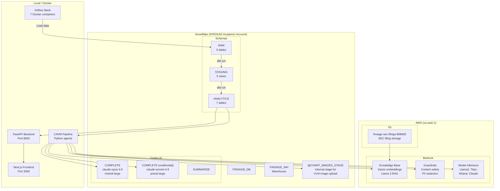
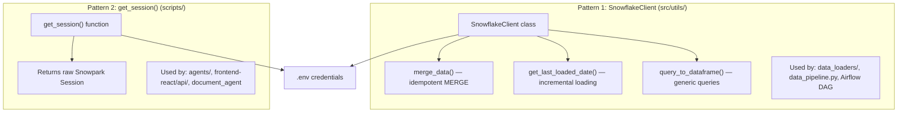
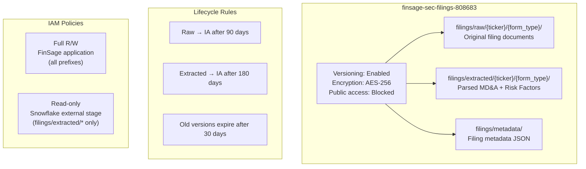
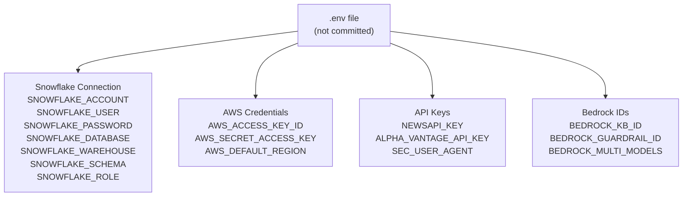
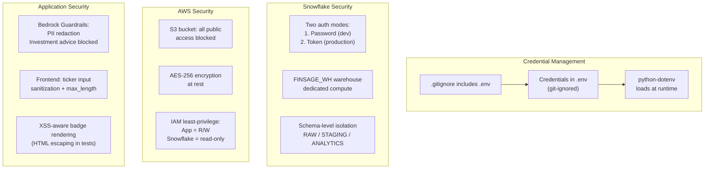

# Infrastructure Architecture — Cloud & Configuration

## What It Covers

FinSage spans two cloud platforms (Snowflake + AWS) with infrastructure-as-code (Terraform), a Docker Compose Airflow stack, and environment-based configuration. This document maps the complete deployment topology.

---

## Cloud Deployment Topology



---

## Snowflake Architecture

### Database Layout

```
FINSAGE_DB
├── RAW (schema)
│   ├── RAW_STOCK_PRICES           (daily OHLCV, merge key: TICKER+DATE)
│   ├── RAW_FUNDAMENTALS           (quarterly, merge key: TICKER+FISCAL_QUARTER)
│   ├── RAW_NEWS                   (articles, merge key: ARTICLE_ID)
│   ├── RAW_SEC_FILINGS            (XBRL, merge key: TICKER+CONCEPT+PERIOD_END+FISCAL_PERIOD)
│   ├── RAW_SEC_FILING_DOCUMENTS   (filing docs, merge key: FILING_ID)
│   └── RAW_SEC_FILING_TEXT        (full text, merge key: TICKER+ACCESSION_NUMBER)
│
├── STAGING (schema) — dbt views
│   ├── stg_stock_prices
│   ├── stg_fundamentals
│   ├── stg_news
│   ├── stg_sec_filings
│   └── stg_sec_filing_documents
│
├── ANALYTICS (schema) — dbt tables
│   ├── dim_company
│   ├── dim_date
│   ├── fct_stock_metrics
│   ├── fct_fundamentals_growth
│   ├── fct_news_sentiment_agg
│   ├── fct_sec_financial_summary
│   └── fct_model_benchmarks        (multi-model latency tracking)
│
└── @RAW.CHART_IMAGES_STAGE         (internal stage for VLM)
```

### Snowflake Cortex Integration Points

| Feature | SQL Interface | Used By | Model |
|---------|-------------|---------|-------|
| **Text LLM** | `SELECT CORTEX.COMPLETE(model, prompt)` | Chart Agent, Analysis Agent, Document Agent | claude-opus-4-6, mistral-large |
| **Vision LLM** | `SELECT CORTEX.COMPLETE(model, prompt, TO_FILE(@stage, path))` | Chart Agent (VLM critique) | claude-sonnet-4-6 |
| **Summarize** | `SELECT CORTEX.SUMMARIZE(text)` | Analysis Agent (SEC filings) | Built-in |

**Why SQL-based Cortex calls:** No API keys needed, data never leaves Snowflake, and the SQL interface integrates naturally with Snowpark sessions already used for data queries.

### Two Snowflake Session Patterns



**Why two patterns:** `SnowflakeClient` wraps the session with data-loading helpers (MERGE, incremental date check). `get_session()` provides a raw session for ad-hoc queries and Cortex calls. The agents need raw SQL flexibility; the loaders need structured MERGE operations.

---

## AWS Architecture

### S3 Bucket (Terraform-managed)



### Terraform Configuration

```hcl
# Key resources defined in terraform/s3/main.tf

resource "aws_s3_bucket" "finsage_filings"          # Bucket creation
resource "aws_s3_bucket_versioning"                   # Version control
resource "aws_s3_bucket_server_side_encryption_configuration"  # AES-256
resource "aws_s3_bucket_public_access_block"          # Block all public access
resource "aws_s3_bucket_lifecycle_configuration"      # IA transitions + expiry
resource "aws_s3_object" "folder_markers"             # Seed folder structure
resource "aws_iam_policy" "finsage_s3_full"           # App R/W policy
resource "aws_iam_policy" "finsage_s3_readonly"       # Snowflake read-only
```

**Why Terraform:** Infrastructure-as-code ensures the S3 bucket is reproducible, version-controlled, and auditable. IAM policies are defined as code rather than manually configured in the AWS Console.

### Bedrock Services

| Service | Resource ID | Purpose |
|---------|------------|---------|
| **Knowledge Base** | `BEDROCK_KB_ID` (env var) | Vector search + RAG over SEC filings |
| **Guardrails** | `BEDROCK_GUARDRAIL_ID` (env var) | Content safety validation |
| **Model Access** | Direct `bedrock-runtime` API | Multi-model inference (Llama3, Titan, Mistral) |

---

## Configuration Management

### Environment Variables (.env)



### Configuration Files

| File | Purpose | Used By |
|------|---------|---------|
| `.env` | Credentials and API keys (git-ignored) | All Python components |
| `config/tickers.yaml` | 50 tracked tickers (5 sectors) | Airflow, data_pipeline, FastAPI |
| `config/cik_cache.json` | Ticker → CIK resolution cache | SECFilingLoader |
| `~/.dbt/profiles.yml` | dbt Snowflake connection | dbt CLI |
| `airflow/docker-compose.yaml` | Airflow stack configuration | Docker |

### DDL Migration History

```
sql/01_create_raw_schema.sql          → CREATE DATABASE, RAW schema, 3 initial tables
sql/02_add_quality_score_column.sql   → ADD DATA_QUALITY_SCORE to stock prices
sql/03_add_quality_to_news.sql        → ADD DATA_QUALITY_SCORE to news
sql/04_add_quality_to_fundamentals.sql→ ADD DATA_QUALITY_SCORE to fundamentals
sql/05_create_staging_schema.sql      → CREATE STAGING schema
sql/06_create_sec_table.sql           → RAW_SEC_FILINGS (XBRL data)
sql/07_create_filing_documents.sql    → RAW_SEC_FILING_DOCUMENTS
sql/07_create_sec_filing_text.sql     → RAW_SEC_FILING_TEXT
sql/08_create_model_benchmarks.sql    → FCT_MODEL_BENCHMARKS (latency tracking)
```

**Why numbered migrations:** Sequential execution ensures schema evolves predictably. Each migration is idempotent (uses CREATE OR REPLACE or IF NOT EXISTS).

---

## Security Architecture



---

## Project Directory Structure

```
finsage-project/
├── agents/                     # CAVM pipeline (Python)
├── airflow/                    # Docker Compose + DAG
│   ├── docker-compose.yaml
│   ├── dags/data_collection_dag.py
│   └── logs/
├── config/                     # tickers.yaml, cik_cache.json
├── dbt_finsage/                # dbt project
│   ├── dbt_project.yml
│   ├── macros/
│   ├── models/staging/         # 5 views
│   └── models/analytics/       # 7 tables
├── frontend-react/             # Next.js + FastAPI
│   ├── app/                    # Next.js pages
│   ├── components/             # React components
│   ├── lib/                    # API client, theme, context
│   └── api/                    # FastAPI backend
│       ├── main.py
│       ├── deps.py
│       └── routers/
├── scripts/                    # Legacy loaders, SEC tools
│   └── sec_filings/            # Bedrock KB, Guardrails, Multi-model
├── sql/                        # DDL migrations (01-08)
├── src/                        # Core library
│   ├── data_loaders/           # 5 loaders + base
│   ├── orchestration/          # data_pipeline.py
│   └── utils/                  # snowflake_client, logger
├── terraform/s3/               # IaC for S3 bucket
├── tests/                      # pytest (7 test files)
├── outputs/                    # Generated reports
├── .env                        # Credentials (git-ignored)
├── requirements.txt            # Core dependencies
└── requirements_2.txt          # Airflow + dbt dependencies
```

---

## Q&A for This Section

**Q: Why Snowflake academic account instead of a cloud data warehouse like BigQuery or Redshift?**
A: Snowflake Cortex provides native LLM/VLM integration via SQL — no separate AI infrastructure needed. The academic account (SFEDU02) provides free credits for the course project.

**Q: Why both Snowflake Cortex and AWS Bedrock?**
A: They serve different purposes. Cortex is for data-proximate LLM analysis (text and chart critique) — data stays in Snowflake. Bedrock provides RAG over document embeddings (Knowledge Base), content safety (Guardrails), and multi-model inference — capabilities Cortex doesn't offer.

**Q: Why not use Snowflake Streams/Tasks for the Airflow DAG?**
A: The pipeline pulls from external APIs (Yahoo Finance, NewsAPI, SEC EDGAR), which requires Python code. Snowflake Tasks can only execute SQL. Airflow provides the flexibility to run arbitrary Python with dependency management.

**Q: How would this scale to production?**
A: Replace local Docker Compose with managed Airflow (Astronomer or MWAA). Use Snowflake OAuth/key-pair auth instead of passwords. Add monitoring (Datadog/CloudWatch). The architecture is already designed for horizontal scaling (thread pools, batch processing).

---

*Previous: [07-orchestration-architecture.md](./07-orchestration-architecture.md) | Next: [09-design-decisions-and-tradeoffs.md](./09-design-decisions-and-tradeoffs.md)*
