# FinSage: AI-Powered Financial Research Report Generator

## A Comprehensive Technical Report

**Project:** DAMG 7374 — Data Engineering: Impact of Generative AI with LLMs  
**Institution:** Northeastern University, Spring 2026  
**Team 8:** Raghu Ram Shanta Rajamani, Ojas Misra, Shrirangesh Vedanarayanan  
**Codebase:** 174,000+ lines across 78 Python files, 20+ TypeScript/React files, 11 dbt models, 9 SQL migrations

---

## 1. Executive Summary

Professional equity research reports cost thousands of dollars and take analyst teams weeks to produce. Less than 10% of U.S. public companies receive institutional coverage, leaving 90% of tickers in the dark for retail investors.

**FinSage closes this gap.** Given a ticker symbol, it generates a 15--20 page branded PDF equity research report — with 8 AI-refined charts, SEC filing analysis, and investment recommendations — in under 7 minutes, at roughly $2 in compute cost.

The system is built on three pillars:

1. **A three-layer Snowflake data warehouse** (RAW → STAGING → ANALYTICS) fed by 5 data loaders pulling from Yahoo Finance, Alpha Vantage, NewsAPI, and SEC EDGAR, orchestrated by Apache Airflow.
2. **A 4-agent AI pipeline (CAVM)** — Chart Agent, Validation Agent, Analysis Agent, Report Agent — that uses Snowflake Cortex LLM/VLM for data-proximate inference and AWS Bedrock for RAG, guardrails, and multi-model consensus.
3. **A React/Next.js frontend** with a FastAPI backend providing interactive analytics, live pipeline monitoring, and conversational Q&A powered by Snowflake Cortex.

| Metric | Value |
|--------|-------|
| End-to-end report generation | < 7 minutes |
| Report length | 15--20 pages, branded PDF |
| Chart types | 8 AI-refined visualizations |
| AI models in pipeline | 4+ (Cortex LLM, Cortex VLM, Bedrock Llama 3, multi-model consensus) |
| Tracked tickers | 50 across 5 sectors |
| Data sources | 5 (Yahoo Finance, Alpha Vantage, NewsAPI, SEC EDGAR XBRL, SEC EDGAR full-text) |
| dbt models | 5 staging views + 6 analytics tables |
| Frontend pages | 6 (Dashboard, Analytics, SEC, Report, Ask, Observability) |
| API endpoints | 25+ REST routes |

---

## 2. Project Overview

### 2.1 Problem Statement

Retail investors face an asymmetric information environment. Institutional research from Goldman Sachs, Morgan Stanley, and JP Morgan is paywalled behind $10,000+ subscriptions. Free alternatives — Yahoo Finance summaries, Seeking Alpha articles — are either too shallow or too biased to support informed decision-making.

Meanwhile, the underlying data is public: stock prices from exchanges, fundamentals from SEC XBRL filings, news from aggregators, and full 10-K/10-Q filings from EDGAR. The problem is not data availability — it is the engineering required to collect, validate, transform, analyze, and present that data at institutional quality.

### 2.2 Solution: Automated Equity Research

FinSage automates the complete equity research workflow:

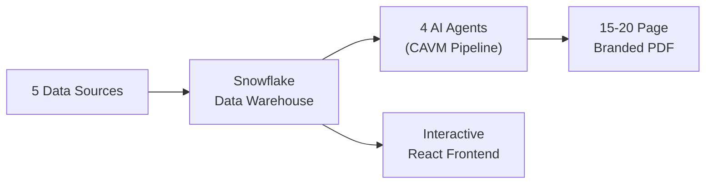

The system replaces a process that takes an analyst 4--8 hours of manual work with an automated pipeline that completes in under 7 minutes — a 30x improvement in throughput at a fraction of the cost.

### 2.3 Key Innovations

| Innovation | Description |
|-----------|-------------|
| **VLM Chart Refinement Loop** | Charts are generated, critiqued by a Vision Language Model that sees the rendered image, and regenerated with feedback — mimicking an analyst reviewing their own work |
| **Chain-of-Analysis** | Each chart is analyzed serially with all prior analyses as context, producing a coherent narrative rather than disconnected bullet points |
| **Multi-Model Consensus** | Investment theses are generated by 3+ LLMs in parallel and synthesized for agreement, disagreement, and confidence scoring |
| **Idempotent Data Pipeline** | Every load uses MERGE statements, making the entire pipeline safely rerunnable without duplicates |
| **Quality Scoring at Ingestion** | Every record receives a 0--100 quality score before entering the warehouse, enabling downstream filtering |
| **Cascading Fallback Architecture** | Every AI component has graceful degradation paths — the pipeline never fails due to a single model timeout |

---

## 3. System Architecture

### 3.1 High-Level Architecture

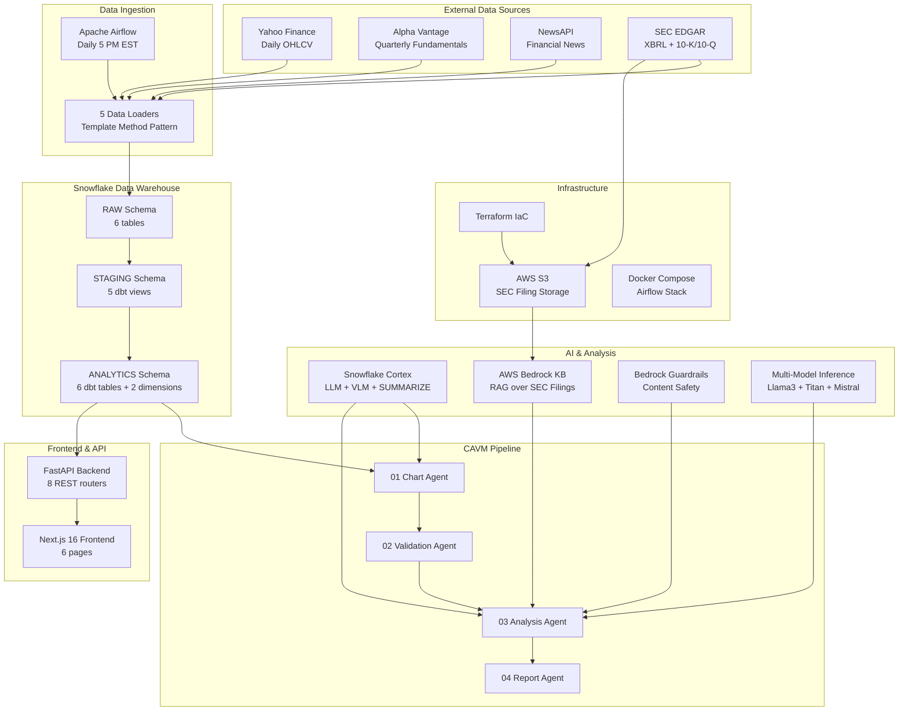

### 3.2 Component Inventory

| Layer | Component | Technology | Lines of Code |
|-------|-----------|------------|---------------|
| Data Loaders | 5 loaders + base class | Python, yfinance, httpx, requests | ~1,800 |
| Orchestration | Pipeline runner + Airflow DAG | Python, ThreadPoolExecutor | ~600 |
| Warehouse | 11 dbt models + 9 SQL migrations | dbt 1.7, Snowflake SQL | ~1,200 |
| CAVM Agents | 10 files (orchestrator + 4 agents + support) | Python, matplotlib, reportlab | ~6,500 |
| SEC/Bedrock | 5 scripts (KB, guardrails, multi-model, document agent) | Python, boto3 | ~2,200 |
| FastAPI API | 8 routers + main + deps | Python, FastAPI, Snowpark | ~2,800 |
| React Frontend | 6 pages + 8 components + 4 lib modules | TypeScript, React 19, MUI 9 | ~4,500 |
| Tests | 7 test files | pytest | ~800 |
| Config & IaC | Terraform, Docker Compose, YAML | HCL, YAML | ~600 |

---

## 4. Three-Layer Data Warehouse

### 4.1 Medallion Architecture

FinSage implements a **RAW → STAGING → ANALYTICS** medallion architecture in Snowflake:

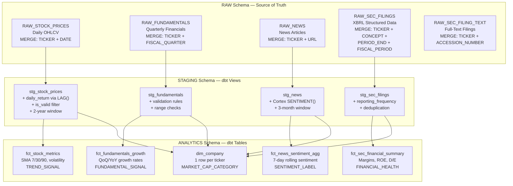

**Design rationale:**

| Layer | Materialization | Why |
|-------|----------------|-----|
| RAW | Snowflake tables | Immutable source of truth with `source`, `ingested_at`, `data_quality_score` lineage columns |
| STAGING | dbt views | Zero storage cost, always fresh on read, lightweight cleaning and validation |
| ANALYTICS | dbt tables | Materialized for performance — SMA, volatility, and growth calculations use expensive window functions |

### 4.2 Derived Signal System

The analytics layer computes four categorical signals consumed by the CAVM pipeline, frontend, and chatbot:

| Signal | Values | Derivation Logic |
|--------|--------|-----------------|
| `TREND_SIGNAL` | BULLISH, BEARISH, NEUTRAL | Close vs 30-day SMA + 7-day vs 30-day SMA crossover |
| `FUNDAMENTAL_SIGNAL` | STRONG_GROWTH, MODERATE_GROWTH, DECLINING, MIXED | YoY revenue and net income growth thresholds |
| `SENTIMENT_LABEL` | BULLISH, BEARISH, NEUTRAL, NO_COVERAGE | 7-day average Cortex sentiment score |
| `FINANCIAL_HEALTH` | EXCELLENT, HEALTHY, FAIR, UNPROFITABLE | Net profit margin + debt-to-equity ratio |

These signals are mapped to investment recommendations by the Report Agent: `BULLISH → BUY (target: +12%)`, `BEARISH → SELL (target: -12%)`, `NEUTRAL → HOLD (target: +3%)`.

### 4.3 Cortex AI Enrichment in dbt

The `stg_news` view calls `SNOWFLAKE.CORTEX.SENTIMENT()` directly in the dbt SQL transformation, computing per-article sentiment scores (-1.0 to +1.0) at the staging layer. This is a notable design choice: AI enrichment happens inside the warehouse transformation pipeline, not as a separate processing step.

---

## 5. Data Pipeline Engineering

### 5.1 Template Method Pattern

All 5 data loaders extend `BaseDataLoader`, an abstract base class that enforces a consistent 5-step loading algorithm:

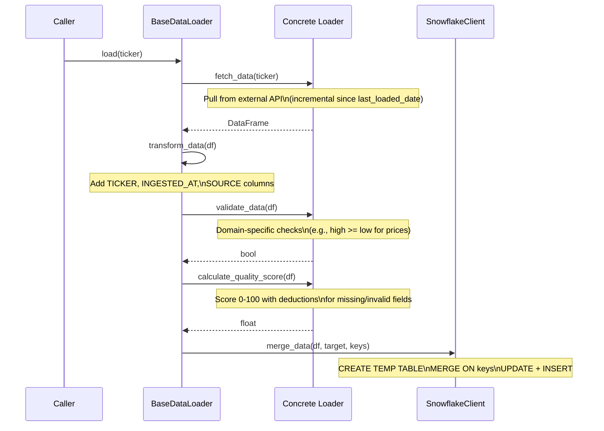

Each loader implements 5 abstract methods — `fetch_data`, `validate_data`, `calculate_quality_score`, `get_target_table`, `get_merge_keys` — while inheriting the orchestration logic. Adding a new data source requires only implementing these 5 methods.

### 5.2 Idempotent MERGE Pattern

Every load operation uses a **temp-staging + MERGE** pattern that guarantees idempotency:

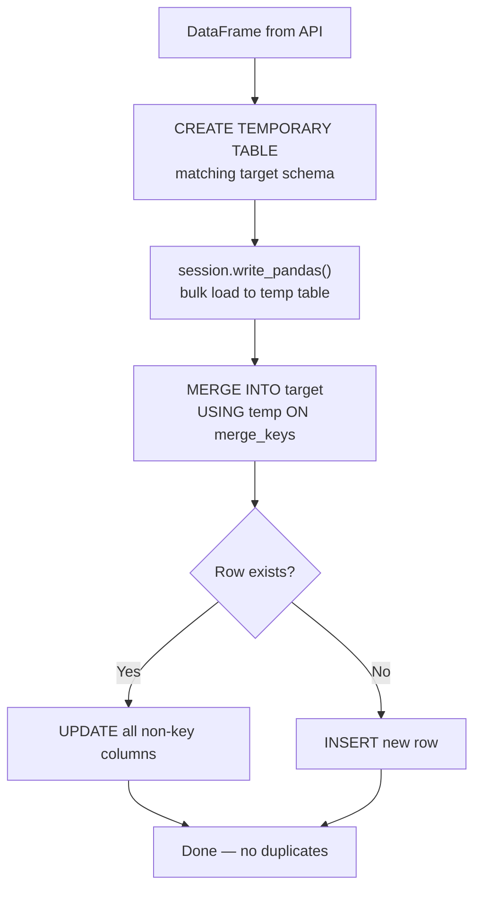

Re-running the pipeline for the same date range is always safe. This is critical when API calls return overlapping date ranges, Airflow retries partially-succeeded tasks, or developers run manual loads during development.

### 5.3 Quality Scoring

Every record receives a `DATA_QUALITY_SCORE` (0--100) before entering the warehouse. Scores start at 100 with domain-specific deductions:

| Loader | Key Deductions |
|--------|---------------|
| Stock Prices | -20 for `high < low`, -30 for NULL OHLC, -10 for price outside range |
| Fundamentals | -30 for NULL revenue, -20 for NULL net income, -10 for NULL EPS |
| News | -30 for NULL title, -10 for NULL content/author/description |
| SEC XBRL | -20 for NULL fiscal year, -10 for NULL period start |
| SEC Filing Text | -40 for avg text < 10K chars, -20 for 10K--50K chars |

Low-quality records are preserved, not discarded. This enables downstream filtering by quality threshold, debugging of data issues, and analytics on quality trends over time.

### 5.4 Incremental Loading

Loaders query `SELECT MAX(date_column) FROM target WHERE TICKER = ?` before each fetch. If a last-loaded date exists, only newer data is requested from the API. This reduces API calls by 90%+ — critical for rate-limited sources like Alpha Vantage (5 calls/minute) and NewsAPI (100 calls/day).

### 5.5 Pipeline Orchestration

`data_pipeline.py` processes tickers in parallel using `ThreadPoolExecutor(max_workers=5)`. Each ticker runs through all enabled loaders sequentially within its thread:

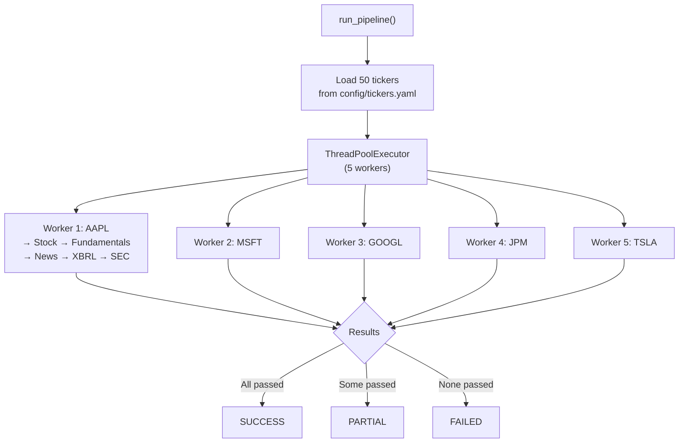

---

## 6. CAVM Multi-Agent Pipeline

The CAVM (Chart-Analysis-Validation-Metrics) pipeline is the core innovation. Four specialized agents coordinate to produce branded equity research reports:

### 6.1 Pipeline Sequence

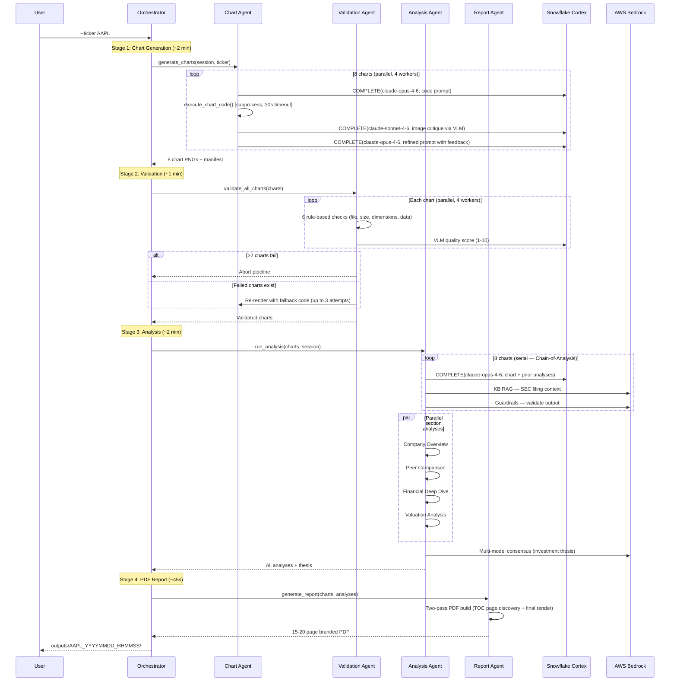

### 6.2 Chart Agent: VLM Refinement Loop

The Chart Agent's core innovation is a **multi-iteration refinement loop** where a Vision Language Model critiques rendered chart images:

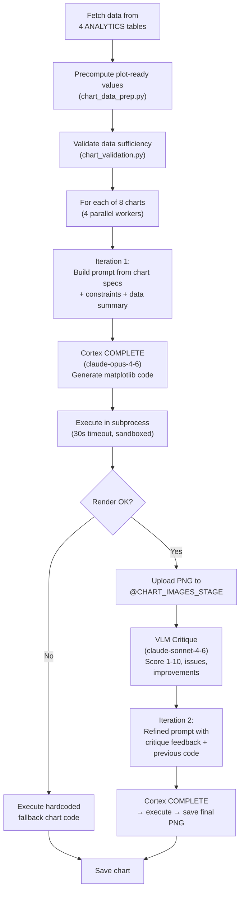

**Why this works:** Single-pass LLM code generation produces charts with ~60% visual quality (overlapping labels, wrong colors, missing legends). The VLM sees the actual rendered image and provides structured feedback (`SCORE: 6/10 / ISSUES: axis labels overlap / IMPROVEMENTS: rotate x-axis labels 45 degrees`). The second iteration incorporates this feedback, achieving ~85%+ quality.

**Safety measures for LLM-generated code:**
- Execution in subprocess with 30-second timeout
- Code sanitization (fixes `fillalpha=` → `alpha=`, removes hallucinated matplotlib methods)
- Automatic date-column conversion (epoch → datetime)
- Hardcoded fallback chart code for every chart type

### 6.3 The 8 Chart Types

| Chart ID | Chart Type | Data Source | Key Visualization |
|----------|-----------|-------------|-------------------|
| `price_sma` | Line + area fill | FCT_STOCK_METRICS | Close price + 3 SMA overlays (7/30/90 day) |
| `volatility` | Dual-axis bar + line | FCT_STOCK_METRICS | Volume bars + 30-day volatility line |
| `revenue_growth` | Grouped bar | FCT_FUNDAMENTALS_GROWTH | YoY revenue vs net income growth % |
| `eps_trend` | Dual-axis line + bar | FCT_FUNDAMENTALS_GROWTH | EPS trend line + growth % bars |
| `financial_health` | Dual-axis bar + line | FCT_SEC_FINANCIAL_SUMMARY | Margin bars + debt-to-equity line |
| `margin_trend` | Line + area fill | FCT_SEC_FINANCIAL_SUMMARY | Net + operating margin trends |
| `balance_sheet` | Stacked bar + line | FCT_SEC_FINANCIAL_SUMMARY | Liabilities/equity stacked + total assets line |
| `sentiment` | Line + fill zones | FCT_NEWS_SENTIMENT_AGG | 7-day avg sentiment with bullish/bearish zones |

All numerical computation happens in `chart_data_prep.py` before the LLM sees the data. The LLM's job is constrained to arranging pre-defined data series into matplotlib code — it never computes or transforms data values.

### 6.4 Chain-of-Analysis

Charts are analyzed in a fixed serial order. Each analysis receives all prior analyses as context:

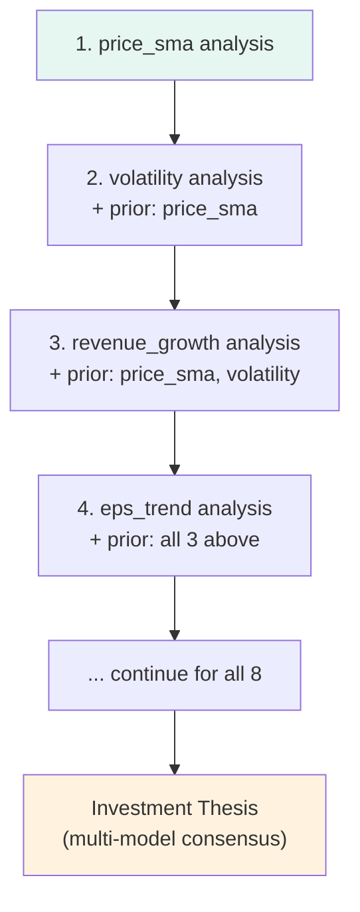

This produces a **progressive narrative** where later insights reference earlier findings:
- Chart 5: *"Consistent with the bullish price trend observed earlier, financial margins show expansion..."*
- Chart 8: *"In contrast to the declining margins, market sentiment remains positive, suggesting..."*

The alternative — parallel analysis — would produce disconnected bullet points. Serial analysis mimics how a human analyst writes a report: building a story, not listing facts.

### 6.5 Validation Agent: Two-Tier Quality Assurance

**Tier 1 (rule-based):** File exists, size > 10KB, dimensions >= 800x400px, data summary populated, data plausibility checks (margins < 100%, D/E < 50).

**Tier 2 (VLM):** Cortex multimodal call evaluates title, axes, colors, data density, legend. Score 1--10; below 6 flags for re-render.

VLM failures are **soft passes** — charts pass if rule-based checks succeed. This prevents VLM non-determinism from blocking report generation.

### 6.6 Report Agent: Branded PDF Assembly

The Report Agent produces a 15--20 page PDF using reportlab with the **Midnight Teal** color scheme:

| Color | Hex | Usage |
|-------|-----|-------|
| Dark | `#0f2027` | Header/footer backgrounds |
| Teal | `#00b4d8` | Accent lines, section headers |
| Bullish | `#06d6a0` | Positive signals, BUY badge |
| Bearish | `#ef476f` | Negative signals, SELL badge |
| Neutral | `#94a3b8` | Neutral/HOLD signals |

**PDF structure:** Cover page (with BUY/HOLD/SELL badge) → Table of Contents → Executive Summary (9-metric grid + thesis) → Company Overview → 8 chart sections (each with header bar, chart image, metrics, AI analysis) → Financial Metrics → Peer Comparison → Risk Factors → Investment Recommendation → Appendix (methodology citations, data architecture, disclaimer).

**Two-pass TOC system:** Pass 1 renders to `BytesIO` with `SectionMarker` flowables that record page numbers. Pass 2 renders the final PDF with correct TOC page numbers. Drift detection warns if pagination differs between passes.

---

## 7. SEC Filing Pipeline & AWS Bedrock Integration

### 7.1 End-to-End Filing Pipeline

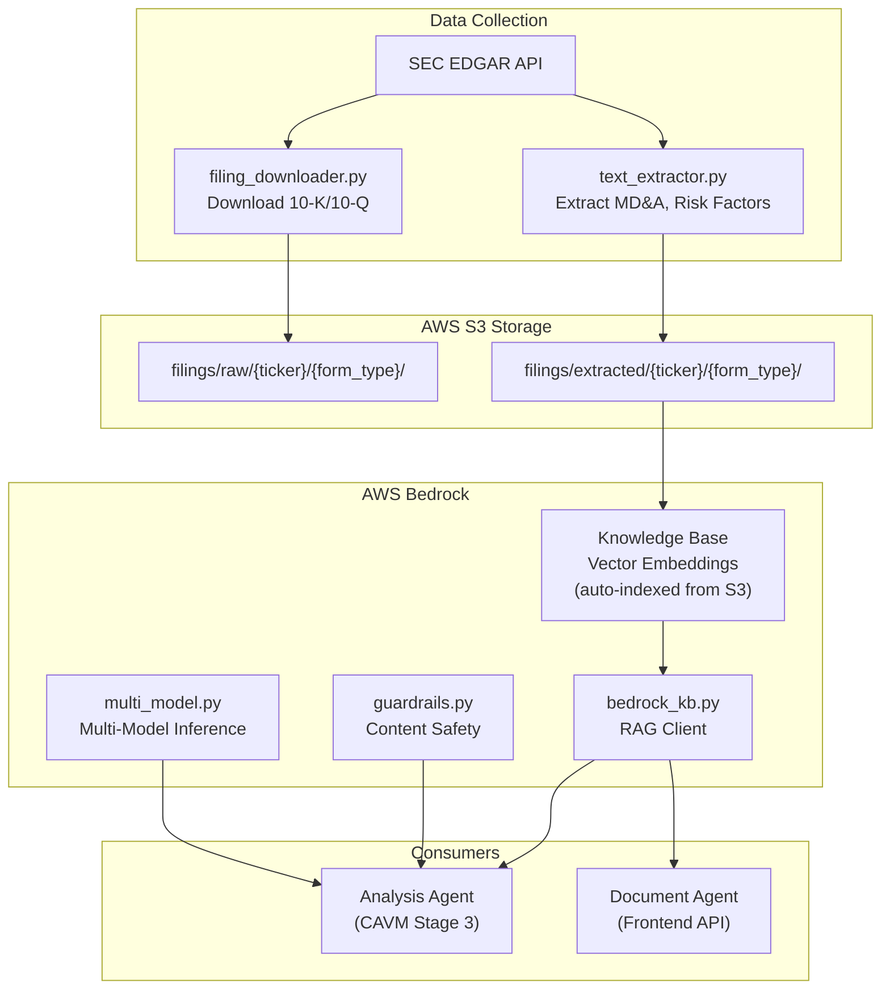

### 7.2 Bedrock Knowledge Base RAG

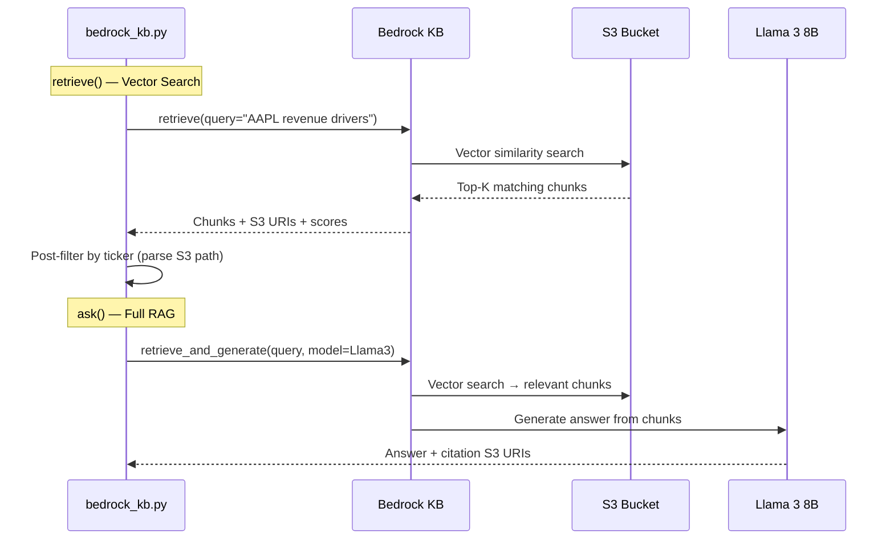

**Post-retrieval ticker filtering** is necessary because Bedrock KB's vector search is semantic, not metadata-filtered. A query about "AAPL revenue" might return MSFT chunks that also discuss revenue. The client prepends the ticker, fetches 3x results, and filters by S3 path.

### 7.3 Guardrails: Content Safety for Financial Reports

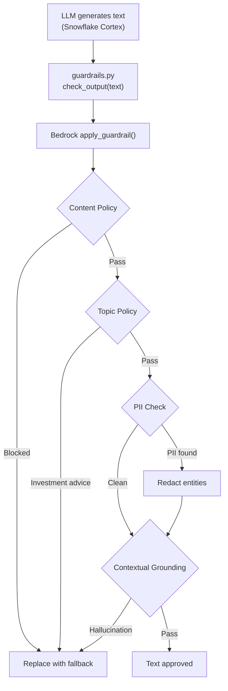

Guardrails are applied **post-hoc** via `apply_guardrail()` — no model call required. Text is generated by Snowflake Cortex, then validated by Bedrock Guardrails. This avoids double model invocation cost and keeps generation inside Snowflake.

### 7.4 Multi-Model Consensus

For investment theses, the same question is sent to 3+ LLMs in parallel via `ThreadPoolExecutor`:

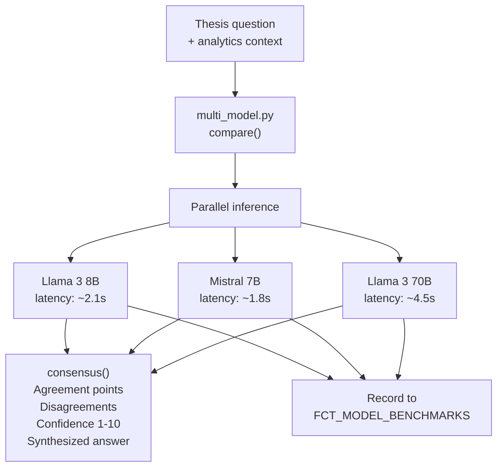

Disagreements between models flag potential hallucinations. The consensus score quantifies reliability in a way no single model can provide.

---

## 8. Frontend & API Architecture

### 8.1 System Topology

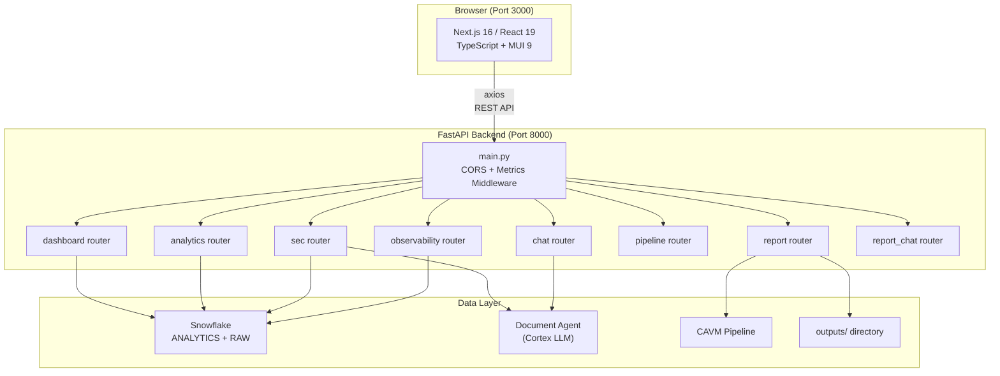

### 8.2 Frontend Pages

| Route | Page | Key Features |
|-------|------|-------------|
| `/` | Dashboard | 5 KPI MetricCards, 4 SignalBadges, interactive PriceChart (TradingView lightweight-charts with SMA overlays + volume), news headlines |
| `/analytics` | Analytics Explorer | 4-tab interface: Stock Metrics, Fundamentals, Sentiment, SEC Financials — each with recharts visualizations and collapsible data tables |
| `/sec` | SEC Filing Analysis | Filing inventory, scatter timeline, 4 Cortex analysis modes (Summary, Risk, MD&A, Cross-Company Comparison) |
| `/report` | Report Generation | Quick Report (Cortex LLM markdown), Full CAVM Pipeline with live 4-stage stepper, animated activity feed, report history, embedded ReportChat |
| `/ask` | Ask FinSage | Full-page chatbot with suggestion pills, cross-ticker comparison, typing indicator, Snowflake Cortex powered |
| `/observability` | Observability | 5-tab view: Health, Pipeline Runs, Data Quality, LLM Calls, Query Attribution |

### 8.3 Ticker Context: App-Wide State Management

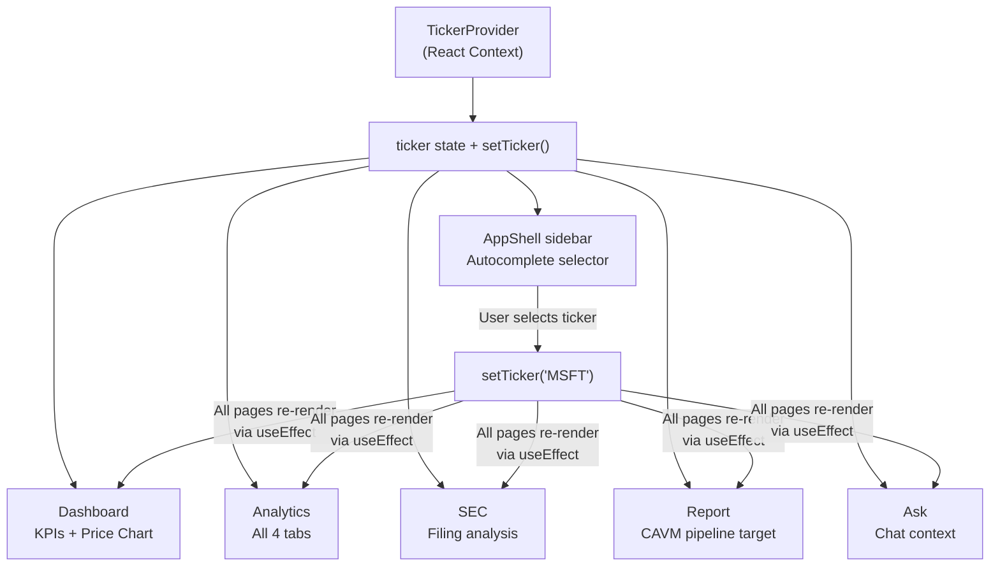

### 8.4 CAVM Pipeline: Async Polling Pattern

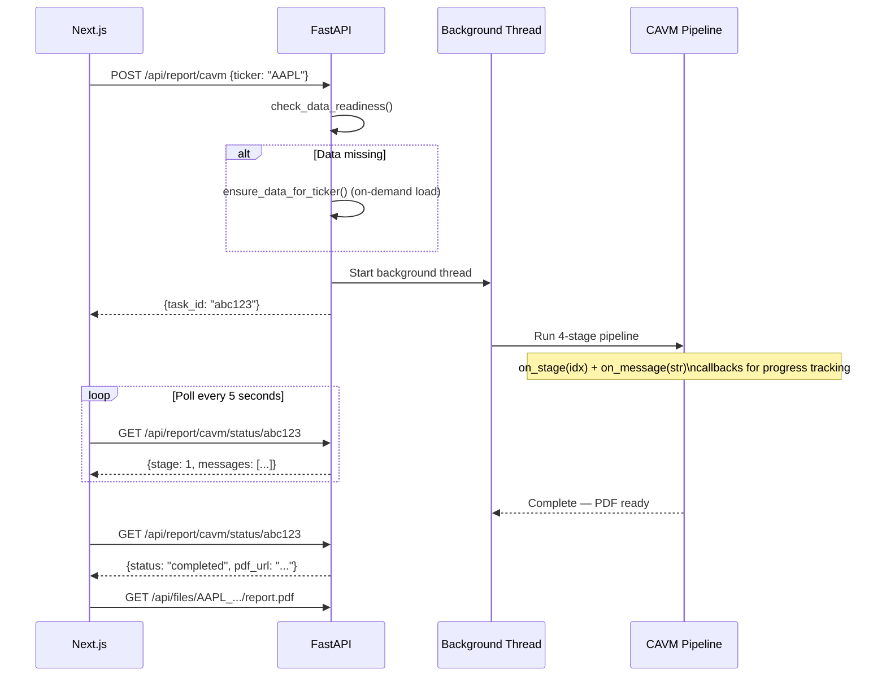

### 8.5 Design System: "Fancy Flirt" Editorial Theme

| Element | Choice | Rationale |
|---------|--------|-----------|
| Primary | `#0382B7` (Star Command Blue) | Interactive elements, price lines |
| Accent | `#03B792` (Jade) | Active nav, buttons, stepper |
| Success | `#9DCBB8` (Rare Jade) | Bullish signals, positive deltas |
| Warning | `#E58B6D` (Trendy Coral) | Bearish signals, failures |
| Headings | DM Serif Display (serif) | Financial report premium feel |
| Body | DM Sans (sans-serif) | Clean, modern readability |
| Cards | White + `#E8E4DB` border | Warm, subtle depth |
| Border radius | 10px global | Soft, editorial aesthetic |

The editorial design with serif headings deliberately differentiates from generic blue-on-white tech dashboards, creating visual continuity with the Midnight Teal PDF reports.

---

## 9. Orchestration: Airflow & dbt

### 9.1 Airflow DAG

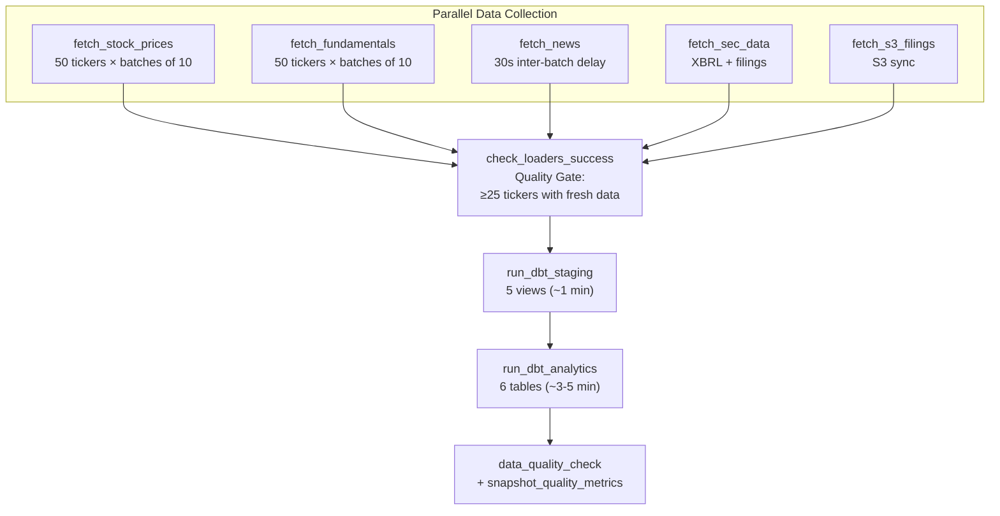

**Schedule:** `0 22 * * 1-5` — 10 PM UTC / 5 PM EST, weekdays after market close.

**Quality gate:** Requires ≥25 distinct tickers with data loaded today across each RAW table. Below this threshold, dbt is blocked from running on stale data. This prevents incomplete analytics tables from misleading downstream consumers.

### 9.2 Docker Compose Topology

The Airflow stack runs 7 containers: PostgreSQL (metadata), Redis (Celery broker), webserver, scheduler, worker, triggerer, and an init container for DB migration. All project directories (`scripts/`, `src/`, `config/`, `dbt_finsage/`, `dags/`) are mounted into the worker container.

### 9.3 dbt Execution Strategy

Staging and analytics are run as separate `dbt run` commands. If staging fails, analytics does not execute (fail-fast). This enables retrying just one layer and ensures staging views exist before analytics tables reference them.

---

## 10. Infrastructure & Security

### 10.1 Cloud Deployment

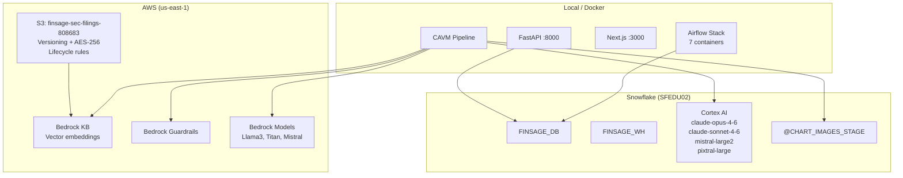

### 10.2 Terraform-Managed Infrastructure

The S3 bucket is fully defined in Terraform HCL: bucket creation, versioning, AES-256 encryption, public access block, lifecycle rules (RAW → Infrequent Access after 90 days), and IAM policies (full R/W for app, read-only for Snowflake external stage).

### 10.3 Security Architecture

| Layer | Measure |
|-------|---------|
| Credentials | `.env` file (git-ignored), loaded via `python-dotenv` |
| Snowflake | Password auth (dev), dedicated `FINSAGE_WH` warehouse, schema-level isolation |
| AWS S3 | All public access blocked, AES-256 at rest, IAM least-privilege |
| Content Safety | Bedrock Guardrails: PII redaction, investment advice blocking, hallucination detection |
| Input Validation | Ticker sanitization (uppercase, alphanumeric, max_length=10) |

**Known gap:** FastAPI queries use f-string SQL interpolation. For production, Snowpark parameterized queries would replace this to prevent SQL injection.

---

## 11. Git Evolution & Iterative Improvement

### 11.1 Development Timeline

The project evolved through 7 documented phases of iterative improvement, tracked in `retrospective.md`:

| Phase | Focus | Key Changes |
|-------|-------|-------------|
| **1** | Bug Fixes | Epoch dates on sentiment chart, "None" operating margin, truncated business segments, HTML entity rendering |
| **2** | Report Depth | Financial Deep Dive section, Valuation Analysis, enhanced Company Overview with competitive landscape |
| **3** | Analysis Quality | Mandatory cross-references in Chain-of-Analysis, upgraded prompts from 3--4 to 4--6 sentences, citation system |
| **4** | Chart Variety | Expanded from 6 to 8 chart types (margin_trend, balance_sheet), dynamic chart selection based on data quality |
| **5** | Model Upgrades | Audited all available Cortex models, upgraded to `claude-opus-4-6` for maximum quality |
| **6** | Gemini Evaluation | Fixed column name mismatches (NET_MARGIN vs NET_MARGIN_PCT), D/E ratio 100x inflation, removed 37 `fillna(0)` anti-patterns, enriched fundamentals loader with annual-to-quarterly data |
| **7** | LLM-as-Judge | Fixed SEC XBRL deduplication (wrong fiscal period selection), D/E percentage-to-ratio normalization in dbt, cross-field consistency validation, net margin SEC/Yahoo override logic |

### 11.2 Recent Git Activity (Last 20 Commits)

Key features delivered in recent commits:
- **Cross-ticker comparison** in both Ask FinSage and ReportChat (`a3f4f80`)
- **Progress callbacks** for real-time CAVM pipeline status tracking (`612be00`)
- **Report history** with folder-based retrieval and PDF download (`1d3e6ea`)
- **Context-based state management** for report page (`1579eee`)
- **50-ticker expansion** with CIK cache for all tickers (`aaa094a`)
- **Evaluation reports** comparing FinSage output against Opus 4.7 and ChatGPT (`5666f04`)

### 11.3 Presentation Materials

10 architectural documentation files were added covering:
1. System Architecture — high-level overview with tech stack rationale
2. Data Pipeline — template method, MERGE, quality scoring, CIK cascade
3. Snowflake Warehouse — three-layer architecture, signal derivation, dbt testing
4. CAVM Pipeline — VLM refinement, Chain-of-Analysis, chart specs
5. SEC Filing Pipeline — S3 storage, Bedrock KB RAG, Guardrails, multi-model
6. Frontend Architecture — component hierarchy, API map, design system
7. Orchestration — Airflow DAG, batch processing, quality gate
8. Infrastructure — cloud topology, Terraform, security
9. Design Decisions — 15 Q&A entries with trade-offs and alternatives
10. Talking Points — presentation flow, demo guide, anticipated questions

---

## 12. Design Decisions & Trade-offs

### 12.1 Architecture-Level

| Decision | Rationale | Trade-off | Alternative Rejected |
|----------|-----------|-----------|---------------------|
| Multi-agent pipeline (4 agents) | Independent failure modes, stage-level retry, `--skip-charts` for iteration | More code complexity, state coordination overhead | Monolithic script; LangChain/CrewAI (overkill for linear flow) |
| Snowflake + AWS Bedrock (dual cloud) | Cortex for data-proximate LLM; Bedrock for RAG, guardrails, multi-model | Two credential sets, cross-platform latency | All-Snowflake (Cortex Search lacked guardrails at time) |
| Three-layer warehouse | Clear responsibility per layer, debugging, rebuild from any layer | Storage cost for analytics tables, more dbt models | Two layers (mixing cleaning with business logic) |
| dbt for transformations | SQL-native, built-in testing, documentation, lineage | SQL-only; Jinja templating for complex logic | Snowpark DataFrames (loses dbt testing ecosystem) |
| Next.js + FastAPI (not Streamlit) | Financial chart library, async pipeline, editorial design, MUI components | Two languages, two servers, CORS complexity | Streamlit (limited charting, no background tasks) |

### 12.2 Data Pipeline

| Decision | Rationale | Trade-off |
|----------|-----------|-----------|
| MERGE over INSERT | Idempotency — safe reruns | Slightly slower for pure inserts |
| Quality scoring over rejection | Preserve low-quality records for debugging | Downstream must filter |
| Incremental loading | 90%+ reduction in API calls | Cannot detect retroactive corrections |

### 12.3 AI & Analysis

| Decision | Rationale | Trade-off |
|----------|-----------|-----------|
| VLM refinement (2 iterations) | 60% → 85%+ chart visual quality | 2x Cortex calls per chart, +5 min runtime |
| Chain-of-Analysis (serial) | Coherent narrative, cross-references | +3 min vs parallel |
| Post-hoc guardrails | Avoids double model cost, keeps generation in Snowflake | Compute wasted if text is rejected |
| Fallback chains everywhere | 5--15 min pipeline never fails due to single timeout | May include unvalidated content |

---

## 13. Performance, Scalability, and Reliability

### 13.1 Pipeline Timing

| Stage | Duration | Bottleneck |
|-------|----------|-----------|
| Data fetch + dbt | ~35-40 min (Airflow DAG) | NewsAPI rate limits |
| CAVM Stage 1: Charts | ~2 min | VLM critique latency |
| CAVM Stage 2: Validation | ~1 min | Parallel rule checks |
| CAVM Stage 3: Analysis | ~2 min | Serial chain (8 Cortex calls) |
| CAVM Stage 4: PDF | ~45 sec | Two-pass reportlab build |
| **Total CAVM** | **~7 min** | Chart generation |

### 13.2 Cascading Fallback Architecture

Every AI component has graceful degradation:

| Component | Primary | Fallback 1 | Fallback 2 |
|-----------|---------|------------|------------|
| Chart code | LLM-generated matplotlib | Hardcoded fallback code | N/A |
| VLM critique | claude-sonnet-4-6 | pixtral-large | Text-only critique |
| KB RAG | Bedrock retrieve | Skip SEC context | N/A |
| Guardrails | check_output() | Include without validation | N/A |
| Multi-model thesis | 3-model consensus | Single Cortex call | N/A |
| VLM validation | VLM score check | Soft pass (include anyway) | N/A |

### 13.3 Scalability Path

The architecture is designed for horizontal scaling without redesign:
- **Data pipeline:** Thread pool workers scale with `max_workers` parameter; batch sizes are configurable
- **CAVM pipeline:** Chart generation already parallelized (4 workers); analysis parallelism limited by Chain-of-Analysis serialization (by design)
- **Frontend:** Stateless FastAPI; horizontal scaling with load balancer
- **Warehouse:** Snowflake auto-scales compute; warehouse size is adjustable
- **50 → 500 tickers:** Increase batch sizes, upgrade API tiers for higher rate limits, larger warehouse

### 13.4 Observability

Four dedicated tables track system health:
- `FCT_PIPELINE_RUNS` — every pipeline stage with duration and status
- `FCT_DATA_QUALITY_HISTORY` — daily quality score snapshots per table/ticker
- `FCT_LLM_CALLS` — Cortex/Bedrock calls with model, latency, token counts
- `FCT_HEALTH_CHECKS` — component health status (60-minute scheduled task)

Snowflake `QUERY_TAG` is set to JSON with `run_id` for cross-referencing queries in `ACCOUNT_USAGE.QUERY_HISTORY`.

---

## 14. Testing Strategy

7 test files with 60+ test cases:

| Test File | Coverage |
|-----------|----------|
| `test_data_loaders.py` | Loader validation rules, quality scoring, MERGE key definitions |
| `test_report_agent.py` | Signal derivation, color mapping, investment rating logic |
| `test_config.py` | Required files exist, tickers.yaml valid, .env keys present |
| `test_helpers.py` | Data formatting, null handling, edge cases |
| `test_ui_helpers.py` | Badge rendering, XSS prevention, HTML escaping |

---

## 15. Known Limitations & Future Work

| Limitation | Impact | Recommended Fix |
|-----------|--------|----------------|
| F-string SQL in FastAPI (no parameterization) | SQL injection risk on ticker input | Snowpark parameterized queries |
| In-memory task store for CAVM status | Status lost on API restart | Redis or database-backed task queue |
| No authentication on frontend | Open access to pipeline triggers | OAuth2 / NextAuth integration |
| VLM refinement adds ~5 min | Pipeline total 5--15 min | Acceptable for quality; `--skip-charts` flag for iteration |
| SEC risk factor summaries are generic | Cortex SUMMARIZE produces boilerplate | Switch to COMPLETE with targeted prompts; pre-chunk risk categories |
| `is_trading_day` is weekday proxy | Doesn't account for market holidays | Holiday calendar integration |

**Future enhancements:**
1. Snowflake Cortex Search for RAG (replacing Bedrock KB when metadata filtering matures)
2. OpenLineage integration in Airflow for end-to-end data lineage
3. Circuit breakers for external API calls (currently retry-only)
4. Snowpark Container Services (SPCS) deployment for production hosting
5. Streaming report generation with server-sent events (replacing polling)

---

## 16. Conclusion

FinSage demonstrates that the convergence of modern data engineering and large language models can automate workflows that traditionally required expensive human expertise. Three technical contributions stand out:

**VLM-in-the-loop code generation** — Using a Vision Language Model to critique and refine LLM-generated visualization code is a pattern applicable well beyond financial charts. It addresses the fundamental gap between code that compiles and output that looks correct.

**Chain-of-Analysis for coherent AI narratives** — Serial analysis with progressive context accumulation produces writing that reads like a human analyst's report, not a collection of independent AI summaries. Each insight builds on the previous, creating a layered argument rather than disconnected observations.

**Defensive data engineering with quality scoring** — Preserving low-quality records with transparent scores, rather than silently discarding them, creates an auditable data pipeline where every downstream consumer can make informed filtering decisions.

The system processes 50 tickers across 5 data sources through a three-layer warehouse, transforms raw data into business-ready analytics with dbt, runs it through a 4-agent AI pipeline with multi-model consensus and content safety guardrails, and delivers the result as both an interactive web application and a branded PDF report.

From raw API call to finished equity research report: under 7 minutes.

---

*FinSage — Team 8 — DAMG 7374 — Northeastern University — Spring 2026*
